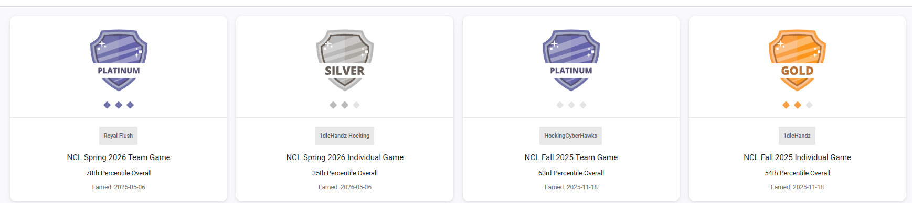

<h1>National Cyber League | Cyber Skyline</h1>
<h3>JAMES JORDON | CYBERSECURITY &amp; NETWORK SYSTEMS</h3>

<strong>Verified competition participation · Individual and team results · Fall 2025–Spring 2026</strong>

<a href="../../">Portfolio Home</a> · <a href="../../final-practicum/">Practicum</a> · <a href="../../technical-work/">Technical Work</a>

---

## Overview

I competed in National Cyber League (NCL) challenges on the Cyber Skyline platform during Fall 2025 and Spring 2026. The competitions tested cybersecurity problem-solving in individual and team formats. My competition handle is `1dleHandz` (also `1dleHandz-Hocking`). These are competition achievements, not industry certifications.

## Official scouting-report results

The **overall national percentiles below come from the official scouting reports**, not the separately displayed badge-dashboard percentiles. Team results represent collective team performance.

| Season | Format / name | National placement | Overall national percentile | Badge |
|---|---|---:|---:|---|
| Spring 2026 | Team — Royal Flush | 229 / 3,634 | **94th** | Platinum |
| Spring 2026 | Individual — 1dleHandz-Hocking | 2,673 / 7,010 | **62nd** | Silver |
| Fall 2025 | Team — HockingCyberHawks | 435 / 4,214 | **90th** | Platinum |
| Fall 2025 | Individual — 1dleHandz | 2,081 / 7,873 | **74th** | Gold |

## Badges

*The dashboard badge percentiles differ from the national scouting-report percentiles. For placement and performance claims, use the official reports linked below.*

## Certificates and scouting reports

All four certificates are **certificates of participation**. Each PDF is preserved unchanged. The external verification links are printed on the originals.

| Competition | Certificate | Detailed scouting report | External verification |
|---|---|---|---|
| Spring 2026 Team | [Certificate](certificates-and-reports/James%20Jordon%20-%20Cyber%20Skyline%20Certificate%20Spring%202026%20Team.pdf) | [Scouting report](certificates-and-reports/James%20Jordon%20-%20Cyber%20Skyline%20Report%20Spring%202026%20Team.pdf) | [Verify certificate](https://cyberskyline.com/verify/2C2XJU6UAR7Q) · [Verify report](https://cyberskyline.com/report/1N9MQ350D4G4) |
| Spring 2026 Individual | [Certificate](certificates-and-reports/James%20Jordon%20-%20Cyber%20Skyline%20Certificate%20Spring%202026%20Ind.pdf) | [Scouting report](certificates-and-reports/James%20Jordon%20-%20Cyber%20Skyline%20Report%20Spring%202026%20Ind.pdf) | [Verify certificate](https://cyberskyline.com/verify/H3NQWKEAQFR8) · [Verify report](https://cyberskyline.com/report/YCVGAMRLY5KE) |
| Fall 2025 Team | [Certificate](certificates-and-reports/James%20Jordon%20-%20Cyber%20Skyline%20Certificate%20Fall%202025%20Team.pdf) | [Scouting report](certificates-and-reports/James%20Jordon%20-%20Cyber%20Skyline%20Report%20Fall%202025%20Team.pdf) | [Verify certificate](https://cyberskyline.com/verify/W0RQ35CVW6GM) · [Verify report](https://cyberskyline.com/report/48G8LEEEQNE6) |
| Fall 2025 Individual | [Certificate](certificates-and-reports/James%20Jordon%20-%20Cyber%20Skyline%20Certificate%20Fall%202025%20Ind.pdf) | [Scouting report](certificates-and-reports/James%20Jordon%20-%20Cyber%20Skyline%20Report%20Fall%202025%20Ind.pdf) | [Verify certificate](https://cyberskyline.com/verify/7UM0K0PGRUUA) · [Verify report](https://cyberskyline.com/report/K78284JN04FN) |

## Demonstrated skills and learning

**Individual evidence:** My Fall 2025 individual scouting report records 89th-percentile open-source intelligence (OSINT), 82nd-percentile log analysis, and 74th-percentile password cracking. My Spring 2026 individual report records 72nd-percentile password cracking and 71st-percentile OSINT. These figures are skill-category percentiles, not overall placements.

**Team evidence:** The Fall 2025 HockingCyberHawks report records 97th-percentile OSINT, 94th-percentile scanning and reconnaissance, and 93rd-percentile network traffic analysis. The Spring 2026 Royal Flush report records 98th-percentile cryptography, 97th-percentile web application exploitation, and 97th-percentile network traffic analysis. These are **team category results**, not proof that I personally completed each challenge.

The reports show my practice in researching publicly available information, investigating password security, reviewing logs, and learning how cybersecurity challenges are solved. The Fall 2025 individual report also documents **five CompTIA-approved continuing education hours**, subject to the relevant certification program's acceptance requirements.

## Professional reflection

These competitions taught me to approach unfamiliar problems systematically, check evidence, collaborate with teammates, and identify areas where I need more practice. They complement my academic AVMC capstone and supervised IT work, but are distinct from employment experience and professional certifications.

## Evidence and publication standards

The official reports are shared as issued, without altered results. I do not publish challenge flags, passwords, restricted solutions, or private information. Percentiles can vary by season and competition type and should not be treated as direct measures of improvement across different participant pools.

---

**James Jordon** · [Return to Professional Portfolio](../../)

