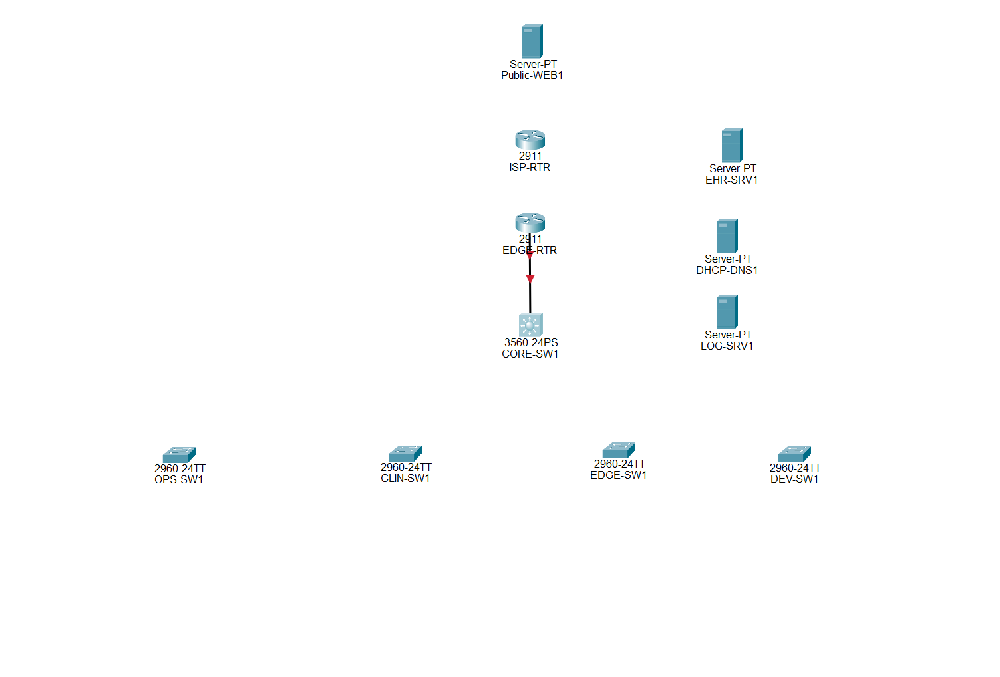
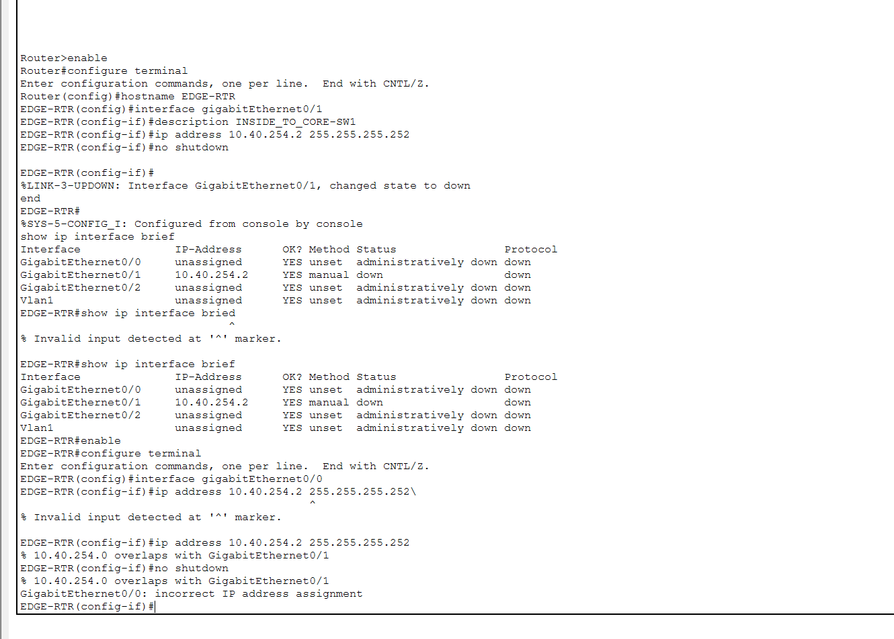
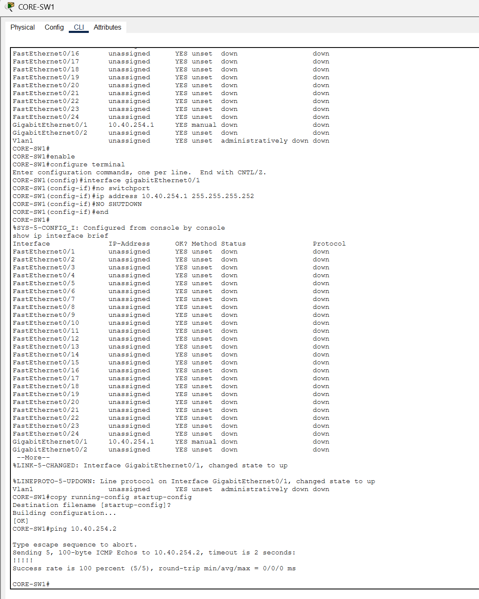
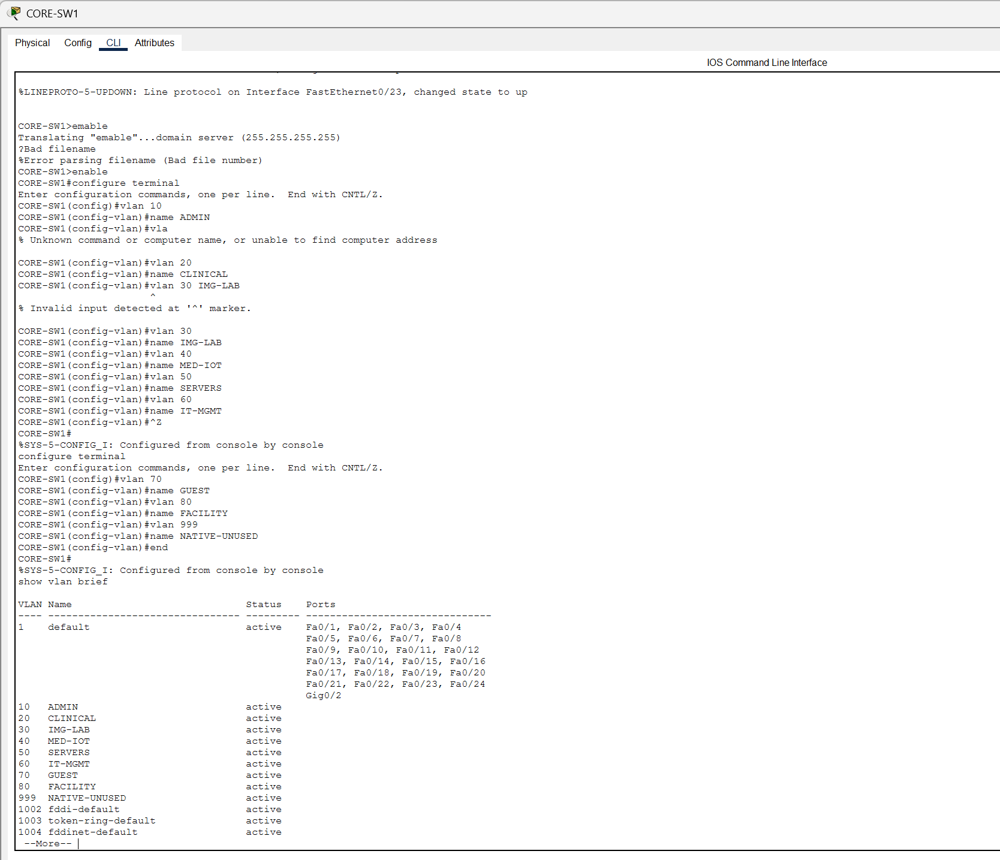
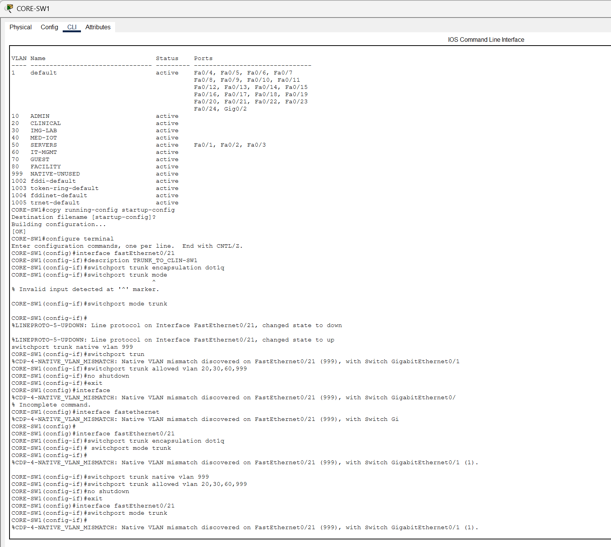
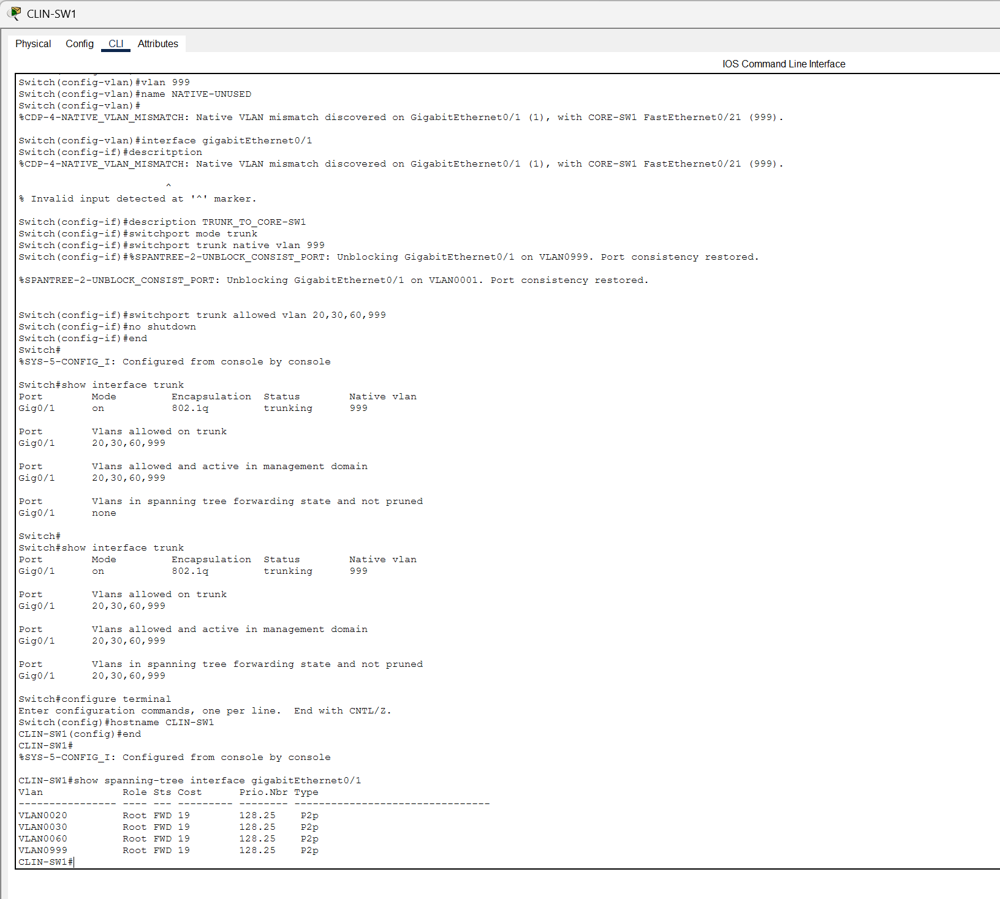
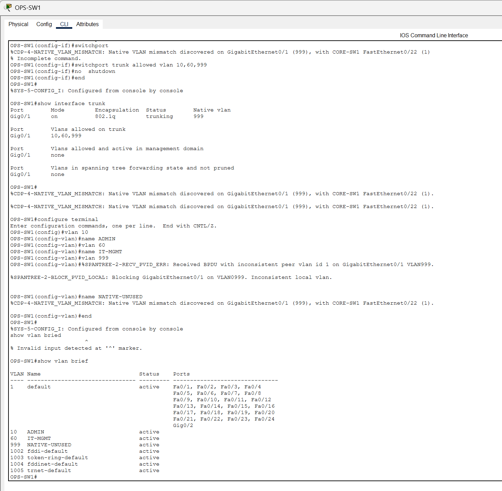
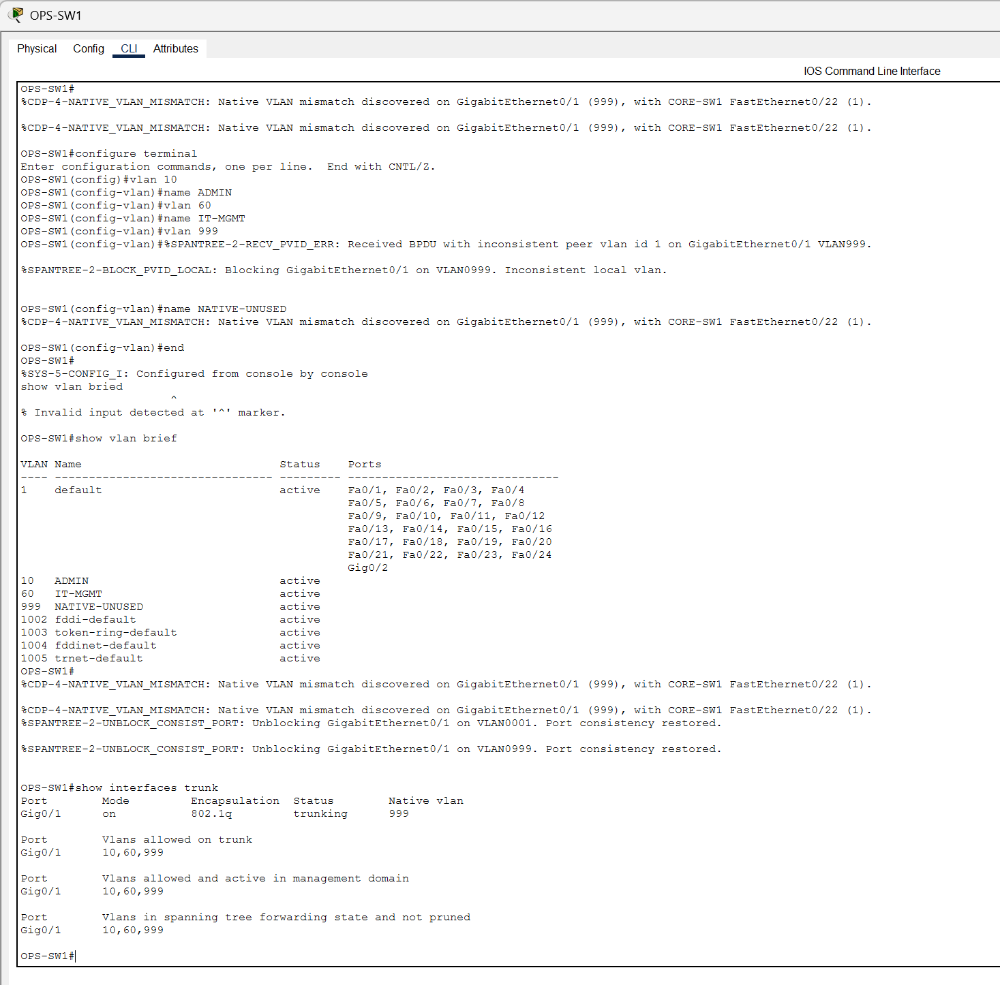
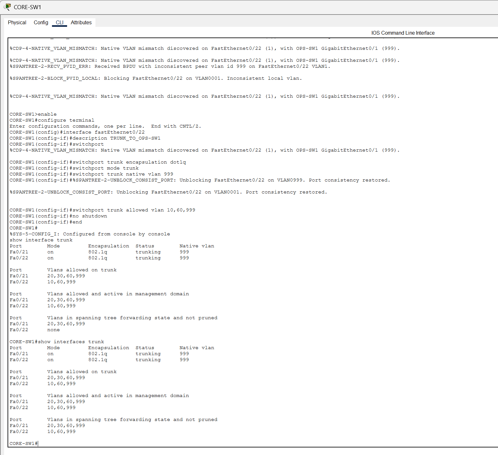

# AVMC Capstone - Week 4 Progress Report

**Student:** James Jordon  
**Course:** NET-2650 Capstone Planning and Implementation  
**Project:** Appalachian Valley Medical Center (AVMC) Network Simulation  
**Packet Tracer file:** `AVMC_Capstone_James Jordon_v1.0.pkt`  
**Architecture:** Two-tier collapsed-core network  
**Week 4 stopping point:** Core/edge routing verified; VLAN foundation complete; server VLAN assigned; CLIN-SW1 and OPS-SW1 trunks operational and forwarding.

> **Scope note:** AVMC is a fictional rural healthcare organization created for a Cisco Packet Tracer capstone. The topology, addressing, device names, and controls in this project are training constructs and do not represent the internal network of any real hospital.

---

## Table of Contents

- [1. Week 4 Executive Summary](#1-week-4-executive-summary)
- [2. Current Architecture](#2-current-architecture)
- [3. Device Inventory at the Week 4 Checkpoint](#3-device-inventory-at-the-week-4-checkpoint)
- [4. Work Completed This Week](#4-work-completed-this-week)
- [5. Verified Configuration State](#5-verified-configuration-state)
- [6. Troubleshooting and Mistakes](#6-troubleshooting-and-mistakes)
- [7. Evidence Gallery](#7-evidence-gallery)
- [8. What Is Not Complete Yet](#8-what-is-not-complete-yet)
- [9. Skills Demonstrated](#9-skills-demonstrated)
- [10. Week 5 / Next Build Plan](#10-week-5--next-build-plan)
- [11. Week 4 Reflection](#11-week-4-reflection)
- [12. Current Project Status](#12-current-project-status)

---

# 1. Week 4 Executive Summary

Week 4 moved the AVMC capstone from a placed-but-unconfigured logical topology into a functioning Layer 2 / Layer 3 network foundation. The most important accomplishment was establishing and verifying the routed transit link between the Cisco 3560 multilayer core switch and the Cisco 2911 edge router. After correcting an interface-selection mistake on the edge router, both sides of the transit network reached an `up/up` state and ICMP testing verified bidirectional reachability.

The core VLAN structure was then created for the hospital's administrative, clinical, imaging/lab, medical-device, server, IT-management, guest, facilities, and native/unused segments. The three internal server-facing core ports were assigned to VLAN 50. Work then moved to the access layer, where the CLIN-SW1 and OPS-SW1 uplinks were configured as IEEE 802.1Q trunks.

Several mistakes occurred during the build, and they were intentionally preserved as evidence. These included configuring the transit IP on the wrong router interface, command-entry syntax errors, native VLAN mismatches, Spanning Tree Protocol consistency blocking, and an OPS-SW1 trunk that initially allowed VLANs that had not yet been created locally. Each problem was diagnosed from Cisco IOS output, corrected, and then retested.

By the end of the Week 4 session, the project had a verified routed edge connection, the complete VLAN database on the core, protected server ports assigned to VLAN 50, and two fully operational access-switch trunks with matching native VLANs and forwarding VLANs.

## Week 4 result at a glance

| Area | Status | Evidence |
|---|---|---|
| Core-to-edge physical link | Complete | Both interfaces `up/up` |
| Core-to-edge IP addressing | Complete | `10.40.254.1/30` and `10.40.254.2/30` |
| Core-to-edge reachability | Complete | Successful ICMP tests |
| Core VLAN database | Complete | VLANs 10, 20, 30, 40, 50, 60, 70, 80, 999 active |
| Internal server access ports | Complete | CORE-SW1 Fa0/1-3 assigned to VLAN 50 |
| CLIN-SW1 trunk | Complete | VLANs 20, 30, 60, 999 forwarding |
| OPS-SW1 trunk | Complete | VLANs 10, 60, 999 forwarding |
| DEV-SW1 trunk | Not started | Planned next |
| EDGE-SW1 trunk | Not started | Planned next |
| SVIs / inter-VLAN routing | Not yet configured | Planned next |
| DHCP / DNS | Not yet configured | Planned later |
| ACLs / security policy | Not yet configured | Planned later |
| ISP / NAT / public test path | Not yet configured | Planned later |

---

# 2. Current Architecture

The AVMC project uses a **two-tier collapsed-core architecture**. CORE-SW1 performs the combined core/distribution role, while the 2960 switches form the access layer. EDGE-RTR provides the hospital perimeter routing function and will later provide NAT/PAT toward the simulated ISP.

```text
                         Public-WEB1
                             |
                          ISP-RTR
                             |
                          EDGE-RTR
                       10.40.254.2/30
                             |
                       10.40.254.1/30
                          CORE-SW1
                          3560-24PS
                 ____________|____________
                |            |            |            |
             OPS-SW1      CLIN-SW1     EDGE-SW1     DEV-SW1
             2960-24TT    2960-24TT    2960-24TT    2960-24TT

                     Internal Server Zone
                  DHCP-DNS1 / EHR-SRV1 / LOG-SRV1
```

At the Week 4 stopping point, the ISP side and remaining access trunks were intentionally left for the next work session. The build was stopped at a known-good checkpoint rather than adding more configuration after a long troubleshooting session.

---

# 3. Device Inventory at the Week 4 Checkpoint

| Device | Platform | Role in the AVMC design | Week 4 state |
|---|---|---|---|
| `CORE-SW1` | Cisco 3560-24PS | Collapsed core/distribution switch; Layer 3 routing, VLAN gateways, DHCP relay, ACL location, server aggregation | Active and partially configured |
| `EDGE-RTR` | Cisco 2911 | Hospital perimeter router between AVMC and the simulated ISP; later NAT/PAT and default routing | Inside link configured and verified |
| `ISP-RTR` | Cisco 2911 | Simulated provider router for the external test network | Placed, not yet configured |
| `CLIN-SW1` | Cisco 2960-24TT | Clinical and imaging/lab access switch | Trunk configured and verified |
| `OPS-SW1` | Cisco 2960-24TT | Administrative and IT-management access switch | Trunk configured and verified |
| `DEV-SW1` | Cisco 2960-24TT | Medical-device / IoT access switch | Placed; trunk not yet configured |
| `EDGE-SW1` | Cisco 2960-24TT | Guest and facilities access switch | Placed; trunk not yet configured |
| `DHCP-DNS1` | Server-PT | Central DHCP and DNS services | Connected to server VLAN port; services not yet configured |
| `EHR-SRV1` | Server-PT | Protected EHR/application placeholder | Connected to server VLAN port; services not yet configured |
| `LOG-SRV1` | Server-PT | Logging/NTP/monitoring placeholder | Connected to server VLAN port; services not yet configured |
| `Public-WEB1` | Server-PT | External web target for later NAT and guest-access testing | Placed; external path not yet configured |

---

# 4. Work Completed This Week

## 4.1 Established the routed CORE-SW1 to EDGE-RTR transit link

A dedicated `/30` transit network was selected for the connection between the collapsed core and the hospital edge router:

| Device | Interface | Address | Mask |
|---|---|---:|---:|
| CORE-SW1 | Gi0/1 | `10.40.254.1` | `255.255.255.252` |
| EDGE-RTR | Gi0/0 | `10.40.254.2` | `255.255.255.252` |

CORE-SW1 Gi0/1 was converted from a Layer 2 switchport into a routed interface:

```text
interface gigabitEthernet0/1
 description ROUTED_LINK_TO_EDGE-RTR
 no switchport
 ip address 10.40.254.1 255.255.255.252
 no shutdown
```

EDGE-RTR Gi0/0 was configured as the internal-facing routed interface:

```text
interface gigabitEthernet0/0
 description INSIDE_TO_CORE-SW1
 ip address 10.40.254.2 255.255.255.252
 no shutdown
```

### Verification

The corrected interfaces reached `up/up`, and the core successfully pinged the edge router with a 100% success rate:

```text
CORE-SW1# ping 10.40.254.2
!!!!!
Success rate is 100 percent (5/5)
```

The first edge-to-core test returned 4/5 successful replies because the first packet was used while ARP resolution occurred. Subsequent communication was successful.

---

## 4.2 Created the AVMC VLAN database on CORE-SW1

The following VLANs were created and verified as active:

| VLAN | Name | Planned function |
|---:|---|---|
| 10 | `ADMIN` | Administrative systems |
| 20 | `CLINICAL` | Clinical workstations |
| 30 | `IMG-LAB` | Imaging and laboratory systems |
| 40 | `MED-IOT` | Medical-device / IoT stand-ins |
| 50 | `SERVERS` | Protected internal services |
| 60 | `IT-MGMT` | Network administration |
| 70 | `GUEST` | Guest wireless clients |
| 80 | `FACILITY` | Facilities / security systems |
| 999 | `NATIVE-UNUSED` | Native trunk VLAN and unused ports |

The use of VLAN 999 as an unused/native VLAN is intentional. It avoids leaving the native VLAN as VLAN 1 and will later also provide a parking VLAN for disabled access ports.

---

## 4.3 Assigned internal server ports to VLAN 50

The internal AVMC servers were assigned dedicated access ports on the core:

| CORE-SW1 port | Server | VLAN |
|---|---|---:|
| Fa0/1 | `DHCP-DNS1` | 50 |
| Fa0/2 | `EHR-SRV1` | 50 |
| Fa0/3 | `LOG-SRV1` | 50 |

Configuration:

```text
interface range fastEthernet0/1-3
 description INTERNAL_SERVER_PORTS
 switchport mode access
 switchport access vlan 50
 spanning-tree portfast
```

`show vlan brief` verified Fa0/1, Fa0/2, and Fa0/3 under VLAN 50.

---

## 4.4 Configured and verified the CLIN-SW1 trunk

The clinical switch uses the following trunk policy:

| Setting | Value |
|---|---|
| CORE-SW1 interface | Fa0/21 |
| CLIN-SW1 interface | Gi0/1 |
| Encapsulation | IEEE 802.1Q |
| Native VLAN | 999 |
| Allowed VLANs | 20, 30, 60, 999 |

CORE-side configuration:

```text
interface fastEthernet0/21
 description TRUNK_TO_CLIN-SW1
 switchport trunk encapsulation dot1q
 switchport mode trunk
 switchport trunk native vlan 999
 switchport trunk allowed vlan 20,30,60,999
 no shutdown
```

CLIN-side configuration:

```text
interface gigabitEthernet0/1
 description TRUNK_TO_CORE-SW1
 switchport mode trunk
 switchport trunk native vlan 999
 switchport trunk allowed vlan 20,30,60,999
 no shutdown
```

VLANs 20, 30, 60, and 999 were also created locally on CLIN-SW1.

### Final verification

`show interfaces trunk` confirmed:

```text
Gi0/1   on   802.1q   trunking   999
```

with:

```text
Vlans allowed on trunk
Gi0/1   20,30,60,999

Vlans allowed and active in management domain
Gi0/1   20,30,60,999

Vlans in spanning tree forwarding state and not pruned
Gi0/1   20,30,60,999
```

`show spanning-tree interface gigabitEthernet0/1` also showed VLANs 20, 30, 60, and 999 in the forwarding state.

---

## 4.5 Configured and verified the OPS-SW1 trunk

The operations switch uses the following trunk policy:

| Setting | Value |
|---|---|
| CORE-SW1 interface | Fa0/22 |
| OPS-SW1 interface | Gi0/1 |
| Encapsulation | IEEE 802.1Q |
| Native VLAN | 999 |
| Allowed VLANs | 10, 60, 999 |

CORE-side configuration:

```text
interface fastEthernet0/22
 description TRUNK_TO_OPS-SW1
 switchport trunk encapsulation dot1q
 switchport mode trunk
 switchport trunk native vlan 999
 switchport trunk allowed vlan 10,60,999
 no shutdown
```

OPS-side configuration:

```text
interface gigabitEthernet0/1
 description TRUNK_TO_CORE-SW1
 switchport mode trunk
 switchport trunk native vlan 999
 switchport trunk allowed vlan 10,60,999
 no shutdown
```

VLANs 10, 60, and 999 were created locally on OPS-SW1.

### Final verification

`show interfaces trunk` confirmed:

```text
Gi0/1   on   802.1q   trunking   999
```

and:

```text
Vlans allowed on trunk
Gi0/1   10,60,999

Vlans allowed and active in management domain
Gi0/1   10,60,999

Vlans in spanning tree forwarding state and not pruned
Gi0/1   10,60,999
```

The final CORE-SW1 verification showed **both completed access trunks forwarding their intended VLAN sets**.

---

# 5. Verified Configuration State

## 5.1 Routed link

```text
CORE-SW1 Gi0/1   10.40.254.1/30   up/up
EDGE-RTR Gi0/0   10.40.254.2/30   up/up
```

## 5.2 Server access ports

```text
CORE-SW1 Fa0/1 -> DHCP-DNS1 -> VLAN 50
CORE-SW1 Fa0/2 -> EHR-SRV1  -> VLAN 50
CORE-SW1 Fa0/3 -> LOG-SRV1  -> VLAN 50
```

## 5.3 Operational trunks

```text
CORE-SW1 Fa0/21 <-> CLIN-SW1 Gi0/1
802.1Q | Native VLAN 999 | Allowed: 20,30,60,999 | Forwarding

CORE-SW1 Fa0/22 <-> OPS-SW1 Gi0/1
802.1Q | Native VLAN 999 | Allowed: 10,60,999 | Forwarding
```

## 5.4 Current core port map

| CORE-SW1 port | Connected device | Remote port | Mode | Week 4 status |
|---|---|---|---|---|
| Fa0/1 | DHCP-DNS1 | Fa0 | Access VLAN 50 | Configured |
| Fa0/2 | EHR-SRV1 | Fa0 | Access VLAN 50 | Configured |
| Fa0/3 | LOG-SRV1 | Fa0 | Access VLAN 50 | Configured |
| Fa0/21 | CLIN-SW1 | Gi0/1 | 802.1Q trunk | Verified / forwarding |
| Fa0/22 | OPS-SW1 | Gi0/1 | 802.1Q trunk | Verified / forwarding |
| Fa0/23 | DEV-SW1 | Gi0/1 | Planned 802.1Q trunk | Next step |
| Fa0/24 | EDGE-SW1 | Gi0/1 | Planned 802.1Q trunk | Next step |
| Gi0/1 | EDGE-RTR | Gi0/0 | Layer 3 routed link | Verified `up/up` |

---

# 6. Troubleshooting and Mistakes

The mistakes below are intentionally documented because they show the troubleshooting process used to reach the verified configuration.

## 6.1 EDGE-RTR IP address was initially placed on the wrong interface

### Symptom

The CORE-SW1 and EDGE-RTR interfaces remained `down/down` even after `no shutdown` was issued.

The edge router initially showed:

```text
GigabitEthernet0/0   unassigned      administratively down   down
GigabitEthernet0/1   10.40.254.2     down                    down
```

The physical cable had been connected to Gi0/0, while the transit IP was configured on Gi0/1.

### Additional error encountered

When attempting to assign `10.40.254.2/30` to Gi0/0 without first removing it from Gi0/1, IOS correctly rejected the configuration:

```text
% 10.40.254.0 overlaps with GigabitEthernet0/1
GigabitEthernet0/0: incorrect IP address assignment
```

### Correction

The IP address was removed from Gi0/1 and that unused interface was shut down:

```text
interface gigabitEthernet0/1
 no ip address
 shutdown
```

The correct interface was then configured:

```text
interface gigabitEthernet0/0
 description INSIDE_TO_CORE-SW1
 ip address 10.40.254.2 255.255.255.252
 no shutdown
```

### Verification

IOS reported both link and line protocol transitions to `up`, followed by successful ICMP testing.

### Lesson learned

A valid Layer 3 address does not help if it is assigned to the wrong physical interface. `show ip interface brief` is one of the fastest ways to compare interface addressing, administrative state, physical state, and protocol state before changing routing configuration.

---

## 6.2 CLI syntax and typing errors

Several commands were initially mistyped, including examples such as:

```text
show ip interface bried
switchport trunk mode
end\
```

IOS returned an `Invalid input detected at '^' marker` message. These errors did not damage the configuration; the commands were simply re-entered correctly.

### Lesson learned

The caret (`^`) in Cisco IOS is useful evidence. It identifies where the parser stopped understanding the command. Rather than changing unrelated configuration, the correct response is to inspect the command at the caret and retry the intended syntax.

---

## 6.3 CLIN-SW1 native VLAN mismatch

### Symptom

CORE-SW1 Fa0/21 was changed to native VLAN 999 before the matching CLIN-SW1 interface was updated. CDP reported:

```text
%CDP-4-NATIVE_VLAN_MISMATCH:
Native VLAN mismatch discovered on FastEthernet0/21 (999),
with Switch GigabitEthernet0/1 (1)
```

### Cause

The two ends of the trunk disagreed:

```text
CORE-SW1 Fa0/21      Native VLAN 999
CLIN-SW1 Gi0/1       Native VLAN 1
```

### Correction

CLIN-SW1 Gi0/1 was configured with:

```text
switchport trunk native vlan 999
```

### STP behavior

After the matching configuration was applied, Packet Tracer reported that the inconsistent port was being unblocked and consistency was restored.

### Verification

The final trunk state showed VLANs 20, 30, 60, and 999 active and forwarding.

### Lesson learned

A native VLAN must match on both ends of an 802.1Q trunk. CDP warnings and STP consistency protection are not merely error messages; they provide direct clues about the exact two interfaces and VLAN IDs involved.

---

## 6.4 OPS-SW1 trunk initially allowed VLANs that did not exist locally

### Symptom

OPS-SW1 initially showed:

```text
Vlans allowed on trunk
Gi0/1   10,60,999

Vlans allowed and active in management domain
Gi0/1   none
```

### Cause

The trunk's allowed list had been configured before VLANs 10, 60, and 999 were created in the local VLAN database on OPS-SW1.

### Correction

The missing VLANs were created:

```text
vlan 10
 name ADMIN
vlan 60
 name IT-MGMT
vlan 999
 name NATIVE-UNUSED
```

### Lesson learned

An allowed VLAN list does not create VLANs. A VLAN must exist locally before it can appear as active on the trunk.

---

## 6.5 OPS-SW1 / CORE-SW1 native VLAN mismatch caused STP consistency blocking

### Symptom

During configuration, the core and OPS switch temporarily disagreed about the native VLAN. IOS generated both CDP and STP messages, including:

```text
%SPANTREE-2-RECV_PVID_ERR
%SPANTREE-2-BLOCK_PVID_LOCAL
```

The port was temporarily blocked because the peer VLAN information was inconsistent.

### Correction

CORE-SW1 Fa0/22 and OPS-SW1 Gi0/1 were both set to native VLAN 999. The allowed VLAN list was also matched as `10,60,999`.

### Recovery evidence

IOS subsequently reported:

```text
%SPANTREE-2-UNBLOCK_CONSIST_PORT
Port consistency restored.
```

The final trunk output showed all intended VLANs in the spanning-tree forwarding state.

### Lesson learned

STP prevented forwarding while the Layer 2 configuration was inconsistent, then automatically restored forwarding when the inconsistency was corrected. This demonstrated why validating both ends of a trunk is necessary before considering the link complete.

---

# 7. Evidence Gallery

## Evidence 1 - Early topology checkpoint



**Figure 1.** Early Week 4 topology checkpoint. The major infrastructure devices had been placed, including the 3560 collapsed core, 2911 edge and ISP routers, four 2960 access switches, three internal servers, and the external public web server. At this stage the core-to-edge link was not yet fully operational, so this image represents an earlier build state rather than the final Week 4 state.

---

## Evidence 2 - EDGE-RTR interface addressing mistake



**Figure 2.** Troubleshooting evidence from EDGE-RTR. The transit IP had originally been placed on Gi0/1 while the cable used Gi0/0. Attempting to reuse the same `/30` on Gi0/0 produced the expected overlapping-subnet error, which led to clearing the incorrect interface configuration.

---

## Evidence 3 - Routed core-to-edge link verified



**Figure 3.** CORE-SW1 verification after the transit-link correction. Gi0/1 was configured as `10.40.254.1/30`, the configuration was saved, and the core successfully pinged EDGE-RTR at `10.40.254.2` with 5/5 replies.

---

## Evidence 4 - AVMC VLAN database created



**Figure 4.** `show vlan brief` on CORE-SW1 showing the AVMC VLAN database. VLANs 10, 20, 30, 40, 50, 60, 70, 80, and 999 are active. The screenshot also shows Fa0/1-3 assigned to VLAN 50 for the internal servers.

---

## Evidence 5 - CLIN-SW1 native VLAN mismatch during configuration



**Figure 5.** CLIN trunk troubleshooting. CORE-SW1 Fa0/21 had already been changed to native VLAN 999 while CLIN-SW1 Gi0/1 was still using VLAN 1. CDP identified the mismatch and the corresponding interfaces. This was corrected by matching VLAN 999 on both ends.

---

## Evidence 6 - CLIN-SW1 trunk verified and forwarding



**Figure 6.** Final CLIN-SW1 trunk verification. Gi0/1 is trunking with 802.1Q, native VLAN 999, and VLANs 20, 30, 60, and 999 active and forwarding. The STP interface output also confirms forwarding state for the permitted VLANs.

---

## Evidence 7 - OPS-SW1 native VLAN / STP inconsistency



**Figure 7.** OPS trunk troubleshooting. The switch reported a native VLAN mismatch and STP PVID inconsistency while CORE-SW1 and OPS-SW1 temporarily disagreed about the native VLAN. The port was protected by STP until the configurations were made consistent.

---

## Evidence 8 - OPS-SW1 trunk verified and forwarding



**Figure 8.** Final OPS-SW1 verification. Gi0/1 is operating as an 802.1Q trunk with native VLAN 999, and VLANs 10, 60, and 999 are active and forwarding.

---

## Evidence 9 - CORE-SW1 verifies both completed access trunks



**Figure 9.** Final core-side Week 4 trunk verification. Fa0/21 and Fa0/22 are both operating as 802.1Q trunks with native VLAN 999. Fa0/21 forwards VLANs 20, 30, 60, and 999; Fa0/22 forwards VLANs 10, 60, and 999.

---

# 8. What Is Not Complete Yet

The Week 4 stopping point is intentionally **not** presented as a finished hospital network. The following work remains:

- Configure the DEV-SW1 trunk on CORE-SW1 Fa0/23 and DEV-SW1 Gi0/1.
- Configure the EDGE-SW1 trunk on CORE-SW1 Fa0/24 and EDGE-SW1 Gi0/1.
- Create and address the Layer 3 SVIs on CORE-SW1.
- Verify `ip routing` and inter-VLAN connectivity.
- Configure access ports for representative administrative, clinical, imaging/lab, medical-device, guest, facilities, and IT-management endpoints.
- Configure management SVIs on the access switches.
- Configure static addresses for DHCP-DNS1, EHR-SRV1, and LOG-SRV1.
- Configure DHCP pools and DHCP relay (`ip helper-address`).
- Configure internal DNS records and the EHR HTTP placeholder.
- Configure the ISP side of the topology.
- Configure EDGE-RTR default routing and AVMC return routing.
- Configure NAT/PAT for outbound Internet simulation.
- Configure guest wireless.
- Configure ACLs for guest isolation and medical-device allowlisting.
- Restrict SSH management access to the IT management workstation.
- Harden unused access ports and place them in VLAN 999.
- Add logging/time configuration where supported by Packet Tracer.
- Execute the final verification matrix and failure/recovery demonstration.

Stopping at this point preserves a stable, verified foundation before additional routing and security controls are introduced.

---

# 9. Skills Demonstrated

The Week 4 work provided hands-on practice with the following networking and troubleshooting skills:

- Cisco IOS CLI navigation and configuration modes
- Interface configuration and administrative state management
- Layer 3 routed switch ports
- IPv4 `/30` transit addressing
- ICMP reachability testing
- VLAN creation and verification
- Access-port VLAN assignment
- IEEE 802.1Q trunk configuration
- Native VLAN selection and matching
- VLAN allowed-list configuration
- Cisco Discovery Protocol warning interpretation
- Spanning Tree Protocol consistency protection
- STP forwarding-state verification
- `show ip interface brief`
- `show vlan brief`
- `show interfaces trunk`
- `show spanning-tree interface ...`
- Configuration persistence with `copy running-config startup-config`
- Evidence-driven troubleshooting instead of random configuration changes

---

# 10. Week 5 / Next Build Plan

The next build session should continue from the saved `AVMC_Capstone_James Jordon_v1.0.pkt` checkpoint in this order:

1. **Complete DEV-SW1 trunk**
   - CORE-SW1 Fa0/23 <-> DEV-SW1 Gi0/1
   - Native VLAN 999
   - Allowed VLANs 40, 60, 999

2. **Complete EDGE-SW1 trunk**
   - CORE-SW1 Fa0/24 <-> EDGE-SW1 Gi0/1
   - Native VLAN 999
   - Allowed VLANs 60, 70, 80, 999

3. **Verify all four access trunks from CORE-SW1**
   - Fa0/21 -> CLIN-SW1
   - Fa0/22 -> OPS-SW1
   - Fa0/23 -> DEV-SW1
   - Fa0/24 -> EDGE-SW1

4. **Create Layer 3 SVIs**
   - VLAN 10 gateway: `10.40.10.1/27`
   - VLAN 20 gateway: `10.40.20.1/26`
   - VLAN 30 gateway: `10.40.30.1/27`
   - VLAN 40 gateway: `10.40.40.1/27`
   - VLAN 50 gateway: `10.40.50.1/28`
   - VLAN 60 gateway: `10.40.60.1/28`
   - VLAN 70 gateway: `10.40.70.1/26`
   - VLAN 80 gateway: `10.40.80.1/28`

5. **Verify the routing foundation before ACLs or services**

This order preserves the troubleshooting principle used throughout Week 4: build one layer at a time, verify it, save it, and only then introduce the next dependency.

---

# 11. Week 4 Reflection

The most important lesson from Week 4 was that network configuration is not simply entering the correct commands once. The troubleshooting output was as important as the final configuration. A wrong physical/interface assumption on the edge router produced a Layer 1 failure even though the intended IP addressing plan was correct. Later, the trunk configuration showed how a mismatch between two otherwise valid switch configurations can trigger CDP warnings and STP protection.

Rather than deleting the mistakes from the project history, they were retained as evidence because they show the diagnostic process. The useful pattern was consistent:

```text
Observe the symptom
       |
Collect IOS evidence
       |
Identify the failing boundary
       |
Change one configuration item
       |
Retest the same condition
       |
Verify recovery
       |
Save the known-good state
```

The native VLAN mismatch was especially useful because Packet Tracer demonstrated a realistic control response. STP temporarily blocked inconsistent forwarding, and the switch later reported that consistency was restored and the port was unblocked. That experience made the relationship between CDP warnings, native VLAN configuration, and STP behavior much clearer than a configuration-only exercise would have.

Week 4 ended with a deliberately limited but stable result. The project now has a functioning Layer 3 transit link, a documented VLAN architecture, a protected server VLAN assignment, and two verified access-layer trunks. That provides a strong foundation for completing the remaining access trunks, SVIs, routing, services, and security controls without losing track of which layer is responsible if a later test fails.

---

# 12. Current Project Status

**Packet Tracer file:** `AVMC_Capstone_James Jordon_v1.0.pkt`

**Current verified state:**

```text
EDGE-RTR Gi0/0        10.40.254.2/30
        |
        | VERIFIED ROUTED TRANSIT
        |
CORE-SW1 Gi0/1        10.40.254.1/30
        |
        +-- Fa0/1-3 -> VLAN 50 internal servers
        |
        +-- Fa0/21 -> CLIN-SW1 Gi0/1
        |             802.1Q / native 999
        |             VLANs 20,30,60,999 FORWARDING
        |
        +-- Fa0/22 -> OPS-SW1 Gi0/1
        |             802.1Q / native 999
        |             VLANs 10,60,999 FORWARDING
        |
        +-- Fa0/23 -> DEV-SW1       NEXT
        |
        +-- Fa0/24 -> EDGE-SW1      NEXT
```

**Week 4 checkpoint conclusion:** The AVMC network has progressed from initial device placement to a verified core/edge routing foundation and partially completed access-layer trunk architecture. The mistakes encountered during configuration were diagnosed and corrected using IOS status, CDP, STP, VLAN, and trunk output, providing documented evidence of both technical progress and troubleshooting methodology.

---

## Repository note

When this file is placed in the final GitHub repository, keep the screenshot folder structure intact:

```text
AVMC-Capstone/
├── README.md
├── docs/
│   ├── WEEK_4_PROGRESS.md
│   └── images/
│       ├── 01_topology_checkpoint.png
│       ├── 02_edge_router_initial_error.png
│       ├── 03_core_edge_verified.png
│       ├── 04_core_vlan_creation.png
│       ├── 05_clin_native_vlan_mismatch.png
│       ├── 06_clin_trunk_verified.png
│       ├── 07_ops_native_vlan_mismatch.png
│       ├── 08_ops_trunk_verified.png
│       └── 09_core_trunks_verified.png
└── packet-tracer/
    └── AVMC_Capstone_James Jordon_v1.0.pkt
```

This preserves the evidence trail and allows every image in this report to render correctly on GitHub.
