[WEEK_5_PROGRESS.md](https://github.com/user-attachments/files/32890279/WEEK_5_PROGRESS.md)
# AVMC Capstone — Week 5 Progress Report

**Project:** Appalachian Valley Medical Center (AVMC) Packet Tracer Capstone  
**Student:** James Jordon  
**Course:** NET-2650 Capstone Planning and Implementation  
**Progress date:** October 1, 2026  
**Packet Tracer file:** `AVMC_Capstone_James Jordon_v1.0.pkt`

> **Week 5 stopping point:** All four access switches are fully trunked, segmented, assigned management SVIs, and hardened. CORE-SW1 is performing inter-VLAN routing for the active hospital VLANs, management reachability is verified to every access switch, and a default route toward EDGE-RTR is installed. VLAN 50 is configured but intentionally remains `up/down` until the internal servers are physically connected.

## Scope and privacy boundary

AVMC is a fictional rural healthcare training environment. The topology, addressing, services, endpoints, security controls, and troubleshooting evidence in this report are simulated for coursework and portfolio demonstration and do not represent the internal network of a real hospital.

## Week 5 objective

Week 5 focused on completing the access layer and moving the simulation from basic Layer 2 connectivity into a routed hospital network. The work included completing DEV-SW1 and EDGE-SW1, bringing CLIN-SW1 and OPS-SW1 up to the same management and hardening standard, enabling inter-VLAN routing on CORE-SW1, validating the management plane, and establishing a default route toward the edge router.

## 1. Week 5 accomplishments at a glance

| Area | Completed work | Status |
|---|---|---|
| DEV-SW1 | VLAN 40/60/999 trunking, MED-IOT access ports, management SVI, PortFast/BPDU Guard, unused-port hardening | ✅ Complete |
| EDGE-SW1 | VLAN 60/70/80/999 trunking, guest/facility ports, management SVI, unused-port hardening | ✅ Complete |
| CLIN-SW1 | Clinical/imaging access ports, management SVI, hardening, trunk re-verification | ✅ Complete |
| OPS-SW1 | Admin/IT access ports, management SVI, hardening, trunk re-verification | ✅ Complete |
| CORE-SW1 | `ip routing`, SVIs for VLANs 10–80, routed management reachability, default route | ✅ Complete |
| VLAN 50 SERVERS | Gateway configured as `10.40.50.1/28`; SVI awaiting a live VLAN member | ⏳ Prepared |
| EDGE-RTR return routing | Summary return route back to hospital networks | ⏭️ Next step |
| Server deployment | DHCP-DNS1, EHR-SRV1, LOG-SRV1 physical links/IP/services | ⏭️ Next step |

## 2. Access-layer design completed

The four access trunks now use VLAN 999 as the native/unused VLAN and carry only the VLANs required by each switch.

| CORE-SW1 port | Access switch | VLANs allowed | Native VLAN |
|---|---|---|---:|
| Fa0/21 | CLIN-SW1 Gi0/1 | 20, 30, 60, 999 | 999 |
| Fa0/22 | OPS-SW1 Gi0/1 | 10, 60, 999 | 999 |
| Fa0/23 | DEV-SW1 Gi0/1 | 40, 60, 999 | 999 |
| Fa0/24 | EDGE-SW1 Gi0/1 | 60, 70, 80, 999 | 999 |

### Management addressing

| Device | Management SVI | Address |
|---|---|---|
| CORE-SW1 | VLAN 60 | `10.40.60.1/28` |
| CLIN-SW1 | VLAN 60 | `10.40.60.2/28` |
| OPS-SW1 | VLAN 60 | `10.40.60.3/28` |
| DEV-SW1 | VLAN 60 | `10.40.60.4/28` |
| EDGE-SW1 | VLAN 60 | `10.40.60.5/28` |

## 3. DEV-SW1 — medical IoT access layer

DEV-SW1 was the first major Week 5 build target. VLANs 40 (`MED-IOT`), 60 (`IT-MGMT`), and 999 (`NATIVE-UNUSED`) were created locally. Gi0/1 was configured as an 802.1Q trunk carrying VLANs 40, 60, and 999.

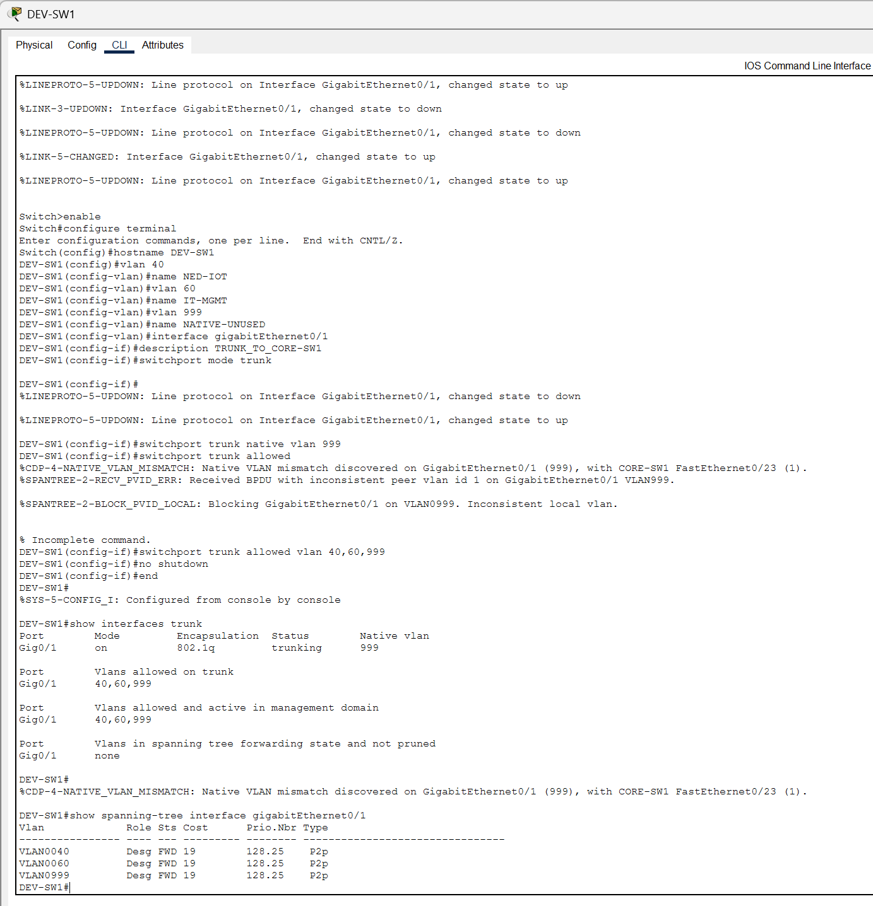

The first trunk attempt produced a CDP native-VLAN mismatch because DEV-SW1 was already using native VLAN 999 while CORE-SW1 Fa0/23 was still using VLAN 1. STP correctly blocked the inconsistent VLAN condition until the CORE side was corrected. After Fa0/23 was configured with native VLAN 999 and allowed VLANs 40,60,999, the port consistency condition cleared and the trunk returned to forwarding.

### DEV-SW1 access-port plan

| Port range | Purpose | VLAN | Security treatment |
|---|---|---:|---|
| Fa0/1–Fa0/8 | Medical/IoT endpoint ports | 40 | Access mode, PortFast, BPDU Guard |
| Gi0/1 | Uplink to CORE-SW1 | trunk | 40,60,999; native 999 |
| Fa0/9–Fa0/24 | Unused | 999 | Access mode, shutdown |
| Gi0/2 | Unused | 999 | Access mode, shutdown |

The planned VLAN 40 endpoints include `BEDSIDE-MON1`, `INFUSION-PUMP1`, `US-CONSOLE1`, `ECG-MON1`, `VITALS-MON1`, `XRAY-CONSOLE1`, and representative medical-device endpoints.

### Week 5 field note: NED-IOT

Packet Tracer's tiny CLI font won one round. VLAN 40 was initially named **`NED-IOT`** instead of **`MED-IOT`**. The VLAN ID and port membership were unaffected; the name was corrected in place with `vlan 40` → `name MED-IOT`.

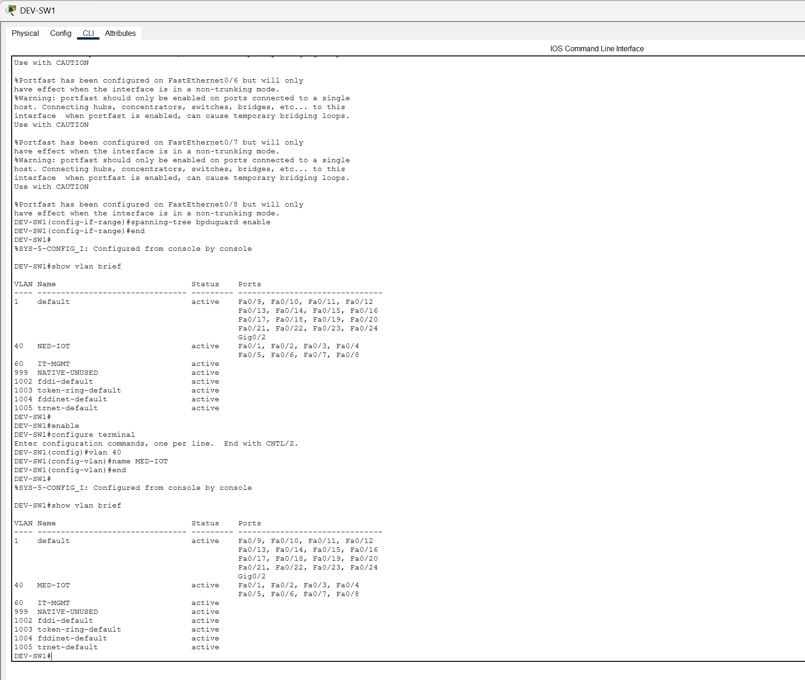

### Troubleshooting: Fa0/2 entered witness protection

While hardening unused ports, `interface range fastEthernet0/2` was entered instead of the intended `fastEthernet0/9-24`. This moved Fa0/2 into VLAN 999 and shut it down. `show vlan brief` exposed the mistake immediately. Fa0/2 was restored to VLAN 40 with PortFast/BPDU Guard and `no shutdown`, then the correct Fa0/9–24 range was hardened.

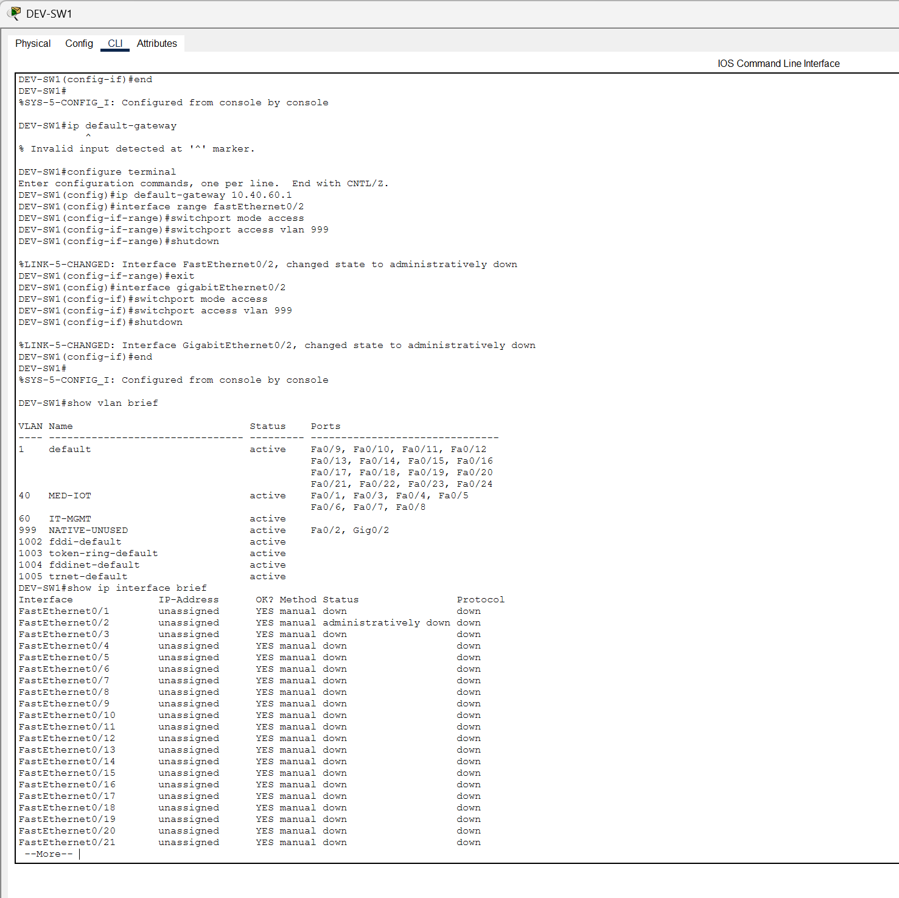

Final DEV-SW1 management was configured as `10.40.60.4/28` with default gateway `10.40.60.1`. The final verification shows Gi0/1 `up/up`, VLAN 60 `up/up`, and unused ports administratively down.

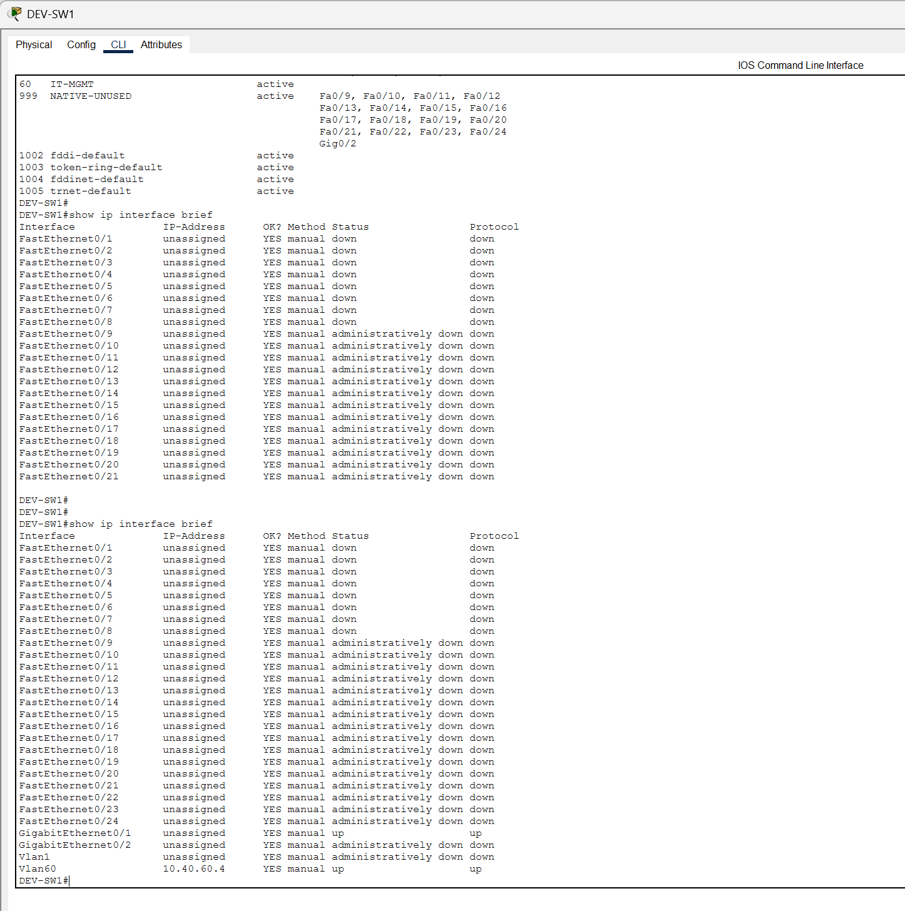

## 4. EDGE-SW1 — guest and physical-security access layer

EDGE-SW1 was configured with VLANs 60 (`IT-MGMT`), 70 (`GUEST`), 80 (`FACILITY`), and 999 (`NATIVE-UNUSED`). Its Gi0/1 trunk carries only 60,70,80,999.

Like DEV-SW1, the first connection generated a native-VLAN mismatch until both sides used native VLAN 999. The console showed STP consistency protection followed by `Port consistency restored`, and the final spanning-tree output showed all four VLANs in `FWD` state.

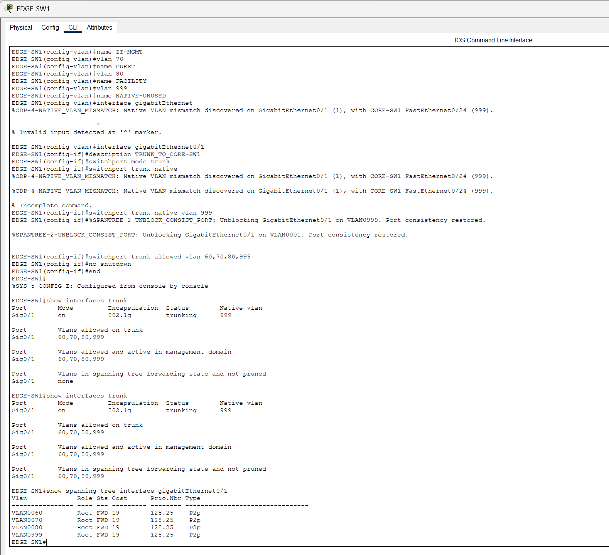

### EDGE-SW1 endpoint plan

| Port | Endpoint role | VLAN |
|---|---|---:|
| Fa0/1 | GUEST-AP1 | 70 |
| Fa0/9 | FACILITY-PC1 | 80 |
| Fa0/10 | CAMERA-01 | 80 |
| Fa0/11 | DOOR-CTRL1 | 80 |
| Fa0/12 | HVAC-CTRL1 | 80 |
| Fa0/13 | BADGE-READER1 | 80 |

Unused ports Fa0/2–8, Fa0/14–24, and Gi0/2 were moved to VLAN 999 and shut down. EDGE-SW1 management was configured at `10.40.60.5/28`.

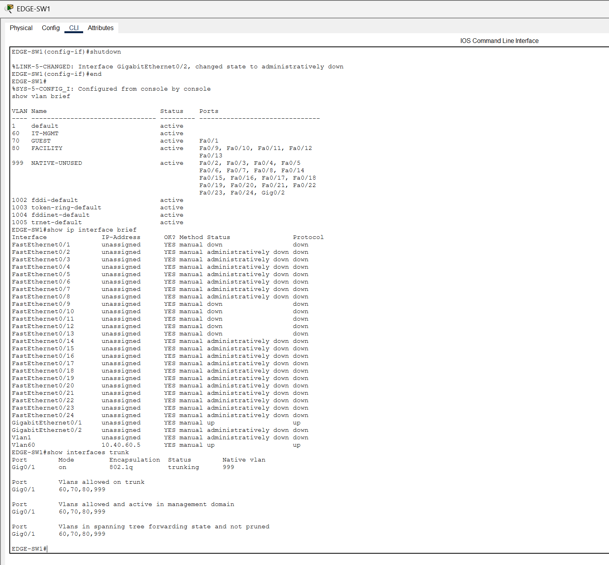

## 5. CLIN-SW1 — clinical and imaging completion

CLIN-SW1 had a working trunk from Week 4, but Week 5 completed its endpoint-facing configuration and management plane.

| Port range | Role | VLAN |
|---|---|---:|
| Fa0/1–7 | Nursing/provider/pharmacy/ER/ICU/NURSE-ADMIN1 | 20 CLINICAL |
| Fa0/13–17 | Radiology/lab/X-ray/CT-MRI/ultrasound workstations | 30 IMG-LAB |
| Fa0/8–12, Fa0/18–24, Gi0/2 | Unused | 999 |

Endpoint ports use PortFast and BPDU Guard. Unused ports are administratively shut down. The VLAN 60 management SVI is `10.40.60.2/28`, and the Gi0/1 trunk remained healthy with VLANs 20,30,60,999 allowed, active, and forwarding.

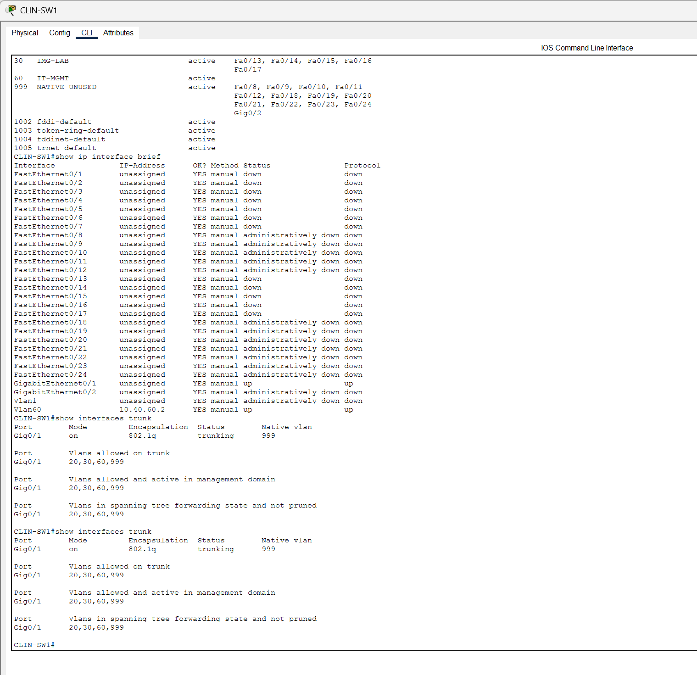

A harmless CLI typo (`switchpoer mode access`) was rejected by IOS and immediately corrected, providing another useful example of why verification output matters.

## 6. OPS-SW1 — administration and IT completion

OPS-SW1 was completed using the same access-layer security standard.

| Port | Endpoint role | VLAN |
|---|---|---:|
| Fa0/1 | REG-PC1 | 10 ADMIN |
| Fa0/2 | BILLING-PC1 | 10 ADMIN |
| Fa0/9 | IT-ADMIN1 | 60 IT-MGMT |
| Fa0/3–8, Fa0/10–24, Gi0/2 | Unused | 999 |

The VLAN 60 management SVI is `10.40.60.3/28`. Gi0/1 remains an 802.1Q trunk with native VLAN 999 and VLANs 10,60,999 allowed, active, and forwarding.

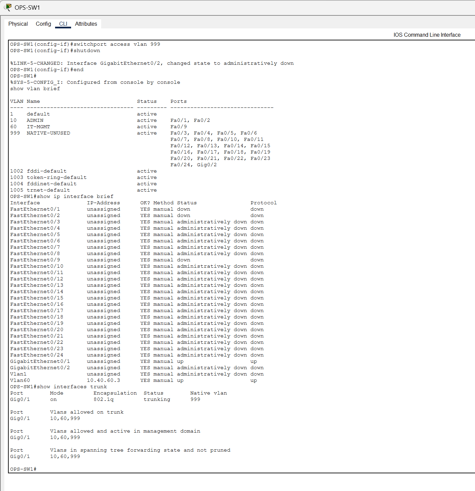

## 7. CORE-SW1 — inter-VLAN routing activated

With the access layer complete, CORE-SW1 was moved into its intended Layer 3 role using `ip routing` and switched virtual interfaces (SVIs).

| VLAN | Name | Gateway | Prefix |
|---:|---|---|---:|
| 10 | ADMIN | `10.40.10.1` | /27 |
| 20 | CLINICAL | `10.40.20.1` | /26 |
| 30 | IMG-LAB | `10.40.30.1` | /27 |
| 40 | MED-IOT | `10.40.40.1` | /27 |
| 50 | SERVERS | `10.40.50.1` | /28 |
| 60 | IT-MGMT | `10.40.60.1` | /28 |
| 70 | GUEST | `10.40.70.1` | /26 |
| 80 | FACILITY | `10.40.80.1` | /28 |

The routed transit link to EDGE-RTR remains `10.40.254.1/30` on CORE-SW1 Gi0/1, with EDGE-RTR at `10.40.254.2/30`.

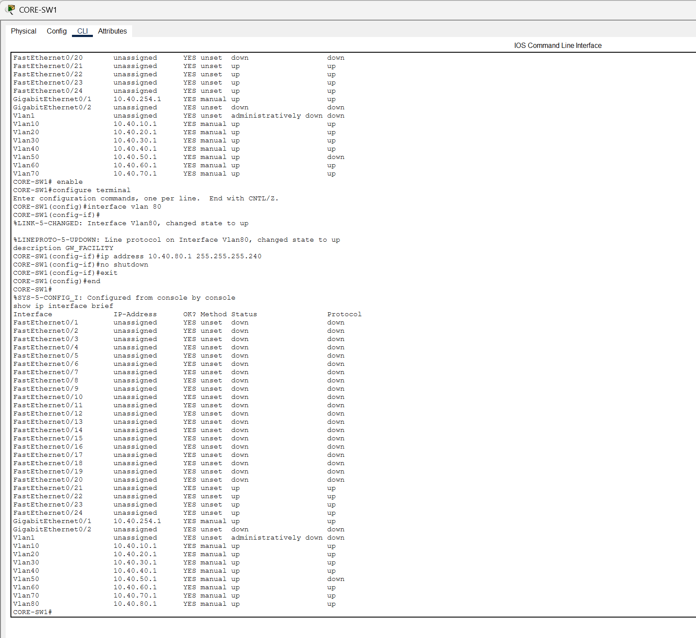

### Why VLAN 50 is `up/down`

VLAN 50 is configured correctly but does not yet have an active Layer 2 member. The server-facing ports have not been physically connected to DHCP-DNS1, EHR-SRV1, or LOG-SRV1, so the SVI is administratively up while its line protocol remains down. This is an expected dependency, not a routing error.

## 8. Troubleshooting: VLAN 10 subnet mask correction

VLAN 10 was initially entered with `255.255.255.192` (/26). The planned ADMIN subnet is `/27`, so the SVI was corrected to `255.255.255.224`.

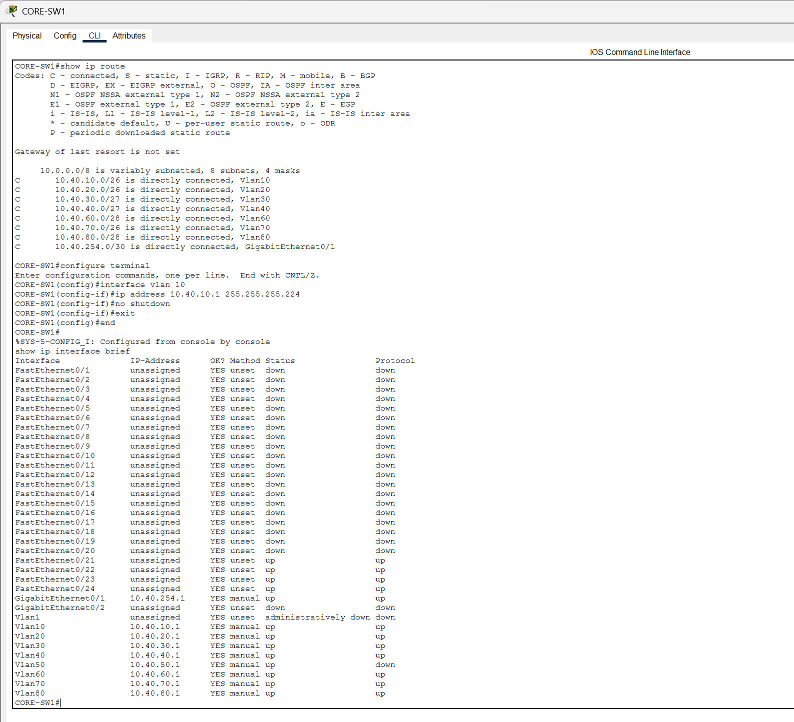

The corrected routing table later confirmed `10.40.10.0/27` as directly connected on Vlan10.

## 9. Routing and management verification

After the SVIs were active, CORE-SW1 successfully learned connected routes for VLANs 10,20,30,40,60,70,80 and the routed transit network. VLAN 50 was correctly absent from the connected table while its SVI line protocol remained down.

The first ICMP tests to the management SVIs returned 60% and the first transit test returned 80%. This was consistent with Packet Tracer resolving ARP/MAC information on the first pass rather than a persistent reachability fault.

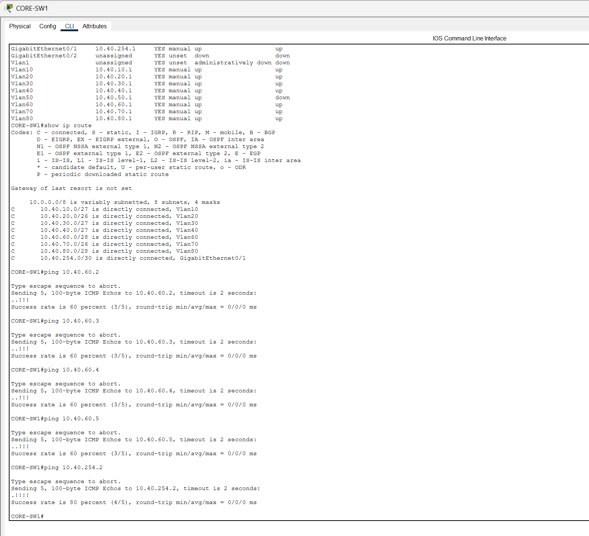

The tests were repeated after the tables had populated. All access-switch management addresses and EDGE-RTR then returned 100% (5/5):

- `10.40.60.2` — CLIN-SW1
- `10.40.60.3` — OPS-SW1
- `10.40.60.4` — DEV-SW1
- `10.40.60.5` — EDGE-SW1
- `10.40.254.2` — EDGE-RTR

CORE-SW1 was then given a default route:

```text
ip route 0.0.0.0 0.0.0.0 10.40.254.2
```

The final routing table shows:

```text
S* 0.0.0.0/0 [1/0] via 10.40.254.2
```

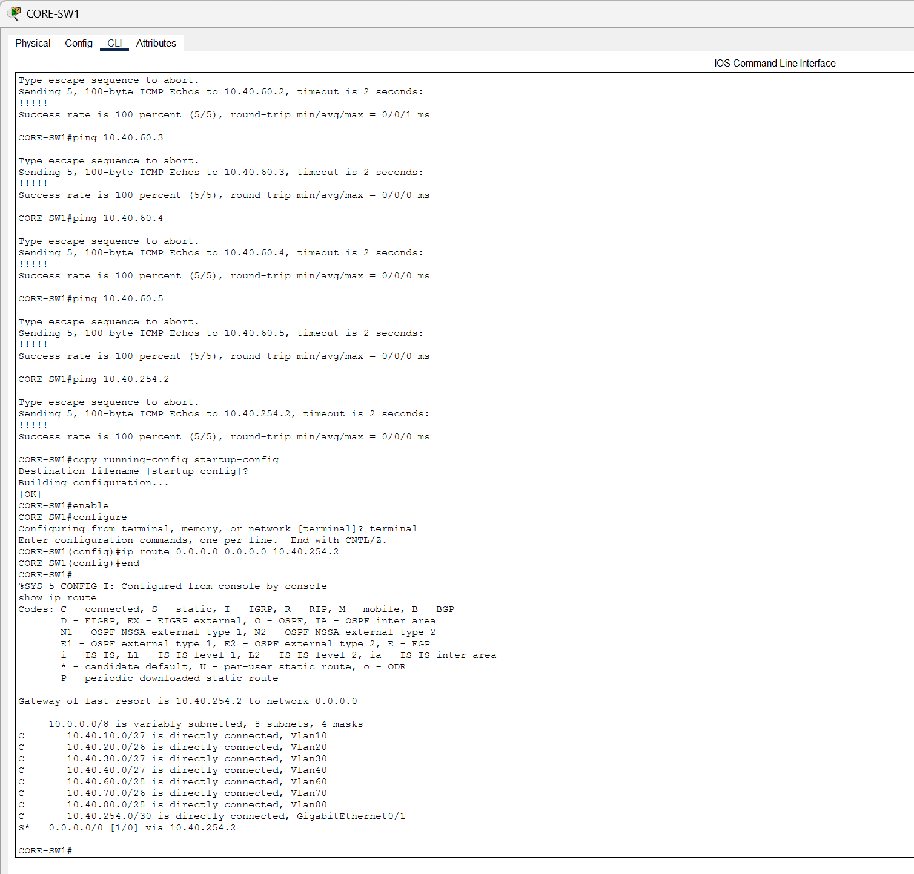

## 10. Troubleshooting and lessons learned

| Event | Symptom/evidence | Resolution | Lesson |
|---|---|---|---|
| DEV native-VLAN mismatch | CDP mismatch + STP PVID inconsistency | Set both sides to native VLAN 999 | Trunk parameters must match end-to-end |
| `NED-IOT` typo | `show vlan brief` displayed wrong name | Renamed VLAN 40 to `MED-IOT` | Labels matter for documentation even when forwarding is unaffected |
| Fa0/2 accidental hardening | Fa0/2 appeared in VLAN 999 and admin-down | Restored Fa0/2 to VLAN 40; hardened Fa0/9–24 instead | Verify ranges before and after bulk changes |
| EDGE native-VLAN mismatch | STP blocked inconsistent VLAN | Corrected EDGE/Core native VLAN to 999 | STP consistency protection is valuable evidence, not noise |
| CLIN CLI typo | IOS rejected `switchpoer` | Re-entered valid command | IOS error messages are part of normal troubleshooting |
| VLAN 10 wrong mask | Route showed `10.40.10.0/26` | Corrected SVI to `/27` | `show ip route` verifies subnet intent, not just interface IPs |
| First-pass ping loss | 60–80% initial ICMP success | Repeated after ARP/MAC learning | Do not diagnose from a single transient test |
| VLAN 50 `up/down` | SVI IP configured but line protocol down | No correction yet; connect servers next | Interface state must be interpreted in topology context |

## 11. Configuration checkpoint at the end of Week 5

```text
CORE-SW1
  Gi0/1 -> EDGE-RTR 10.40.254.1/30    UP/UP
  Fa0/21 -> CLIN-SW1                   UP/UP
  Fa0/22 -> OPS-SW1                    UP/UP
  Fa0/23 -> DEV-SW1                    UP/UP
  Fa0/24 -> EDGE-SW1                   UP/UP

Management VLAN 60
  CORE-SW1  10.40.60.1/28
  CLIN-SW1  10.40.60.2/28
  OPS-SW1   10.40.60.3/28
  DEV-SW1   10.40.60.4/28
  EDGE-SW1  10.40.60.5/28

CORE default route
  0.0.0.0/0 -> 10.40.254.2

Pending dependency
  Vlan50 10.40.50.1/28 -> configured, line protocol down until a server link is active
```

## 12. Next steps for Week 6 / next build session

1. Configure EDGE-RTR return routing toward the hospital, beginning with a summary route for `10.40.0.0/16` via `10.40.254.1`.
2. Connect CORE-SW1 Fa0/1–3 to DHCP-DNS1, EHR-SRV1, and LOG-SRV1 as VLAN 50 access ports.
3. Assign server addresses: DHCP-DNS1 `10.40.50.2/28`, EHR-SRV1 `10.40.50.3/28`, LOG-SRV1 `10.40.50.4/28`, gateway `10.40.50.1`.
4. Verify VLAN 50 changes from `up/down` to `up/up` and appears as a connected route.
5. Configure DHCP/DNS services and begin bringing representative clinical, imaging, medical-IoT, guest, and facilities endpoints online.
6. Build and test ACLs that enforce the intended healthcare segmentation policy.
7. Continue preserving before/after screenshots for both successful changes and troubleshooting events.

## 13. Week 5 reflection

Week 5 moved the AVMC simulation from a partially trunked topology into a structured routed network with a consistent management plane. The strongest part of the work was not that every command worked on the first try—it did not—but that each configuration error was visible in Cisco output, traced to a specific cause, corrected, and verified with a second command or connectivity test.

The result at this stopping point is a much more realistic hospital-network foundation: clinical, imaging, medical-IoT, administrative, guest, facilities, server, and management networks have defined Layer 2/Layer 3 boundaries; unused ports are intentionally parked and disabled; and CORE-SW1 can reach every access-switch management address and the edge router.

---

### Evidence set

This report deliberately uses a reduced evidence set. Duplicate or near-duplicate screenshots were excluded; the retained images were selected because each shows a distinct milestone, mistake, correction, or final verification state.
