# AVMC Capstone - Week 6 Progress Report

**Project:** Appalachian Valley Medical Center (AVMC) Packet Tracer Capstone  
**Student:** James Jordon  
**Course:** NET-2650 Capstone Planning and Implementation  
**Progress date:** October 1, 2026  
**Packet Tracer checkpoint:** `AVMC_Capstone_James Jordon_v3.0.pkt` (student-saved Week 6 checkpoint)

> **Week 6 stopping point:** The routed hospital core now has a working return path through EDGE-RTR, VLAN 50 server infrastructure is online, centralized DHCP and DNS are functioning across routed VLANs, representative administrative, clinical, and imaging endpoints have been brought online and validated, and the first wireless medical-IoT endpoint has been associated to the MED-IOT access point and successfully passed a Packet Tracer Simple PDU test to CORE-SW1. The next major phase is security enforcement and expansion of the remaining endpoint classes.

## Scope and privacy boundary

AVMC is a fictional rural healthcare training environment. The topology, addressing, server names, endpoints, security controls, and test results documented here are simulated for coursework and portfolio demonstration. They do not describe the internal network of a real healthcare organization.

## Week 6 objective

Week 6 moved the project from a routed but mostly infrastructure-only design into a functioning client/server environment. The main goals were to finish bidirectional routing between CORE-SW1 and EDGE-RTR, activate the server VLAN, stand up DHCP and DNS, relay DHCP requests across the Layer 3 core, attach representative hospital endpoints, prove application-layer reachability to the EHR service, and begin the medical-IoT deployment on DEV-SW1.

## 1. Week 6 accomplishments at a glance

| Area | Completed work | Status |
|---|---|---|
| EDGE-RTR return path | Added summary route for AVMC internal networks via CORE-SW1 and validated management reachability | Complete |
| VLAN 50 SERVERS | Connected server-facing ports, brought Vlan50 `up/up`, verified route and server reachability | Complete |
| DHCP relay | Added `ip helper-address 10.40.50.2` to routed client VLANs | Complete |
| DHCP-DNS1 | Built pools for ADMIN, CLINICAL, IMG-LAB, MED-IOT, GUEST, and FACILITY | Complete |
| DNS | Added `dhcp.avmc.local`, `ehr.avmc.local`, and `logs.avmc.local` A records | Complete |
| EHR service | EHR-SRV1 at `10.40.50.3/28`; HTTP/HTTPS enabled and reachable by name | Complete |
| ADMIN clients | REG-PC1 and BILLING-PC1 received DHCP and passed gateway/server/DNS tests | Complete |
| IT management client | IT-ADMIN1 validated against VLAN 60 gateway and internal servers | Complete |
| CLINICAL clients | NURSE-PC1 and additional clinical endpoints attached; NURSE-PC1 fully validated | Complete |
| IMG-LAB clients | RAD-PC1 fully validated; lab/imaging workstations reached the VLAN 30 gateway | Complete |
| MED-IOT wireless | DEV-SW1 Fa0/1 activated for an access point; BEDSIDE-MON1 associated and received DHCP | Checkpoint reached |
| Security enforcement | 802.1X, ACLs, and later hardening intentionally deferred until baseline functionality is established | Next phase |

## 2. Routing completion - EDGE-RTR return route

Week 5 ended with CORE-SW1 using a default route toward EDGE-RTR, but EDGE-RTR still needed a path back to the hospital networks. The Week 6 build added the following summary static route:

```text
ip route 10.40.0.0 255.255.0.0 10.40.254.1
```

This gives EDGE-RTR a single return route covering the AVMC `10.40.0.0/16` internal addressing space. The route table showed the summary as static via `10.40.254.1`, and EDGE-RTR successfully pinged all access-switch management addresses on VLAN 60.

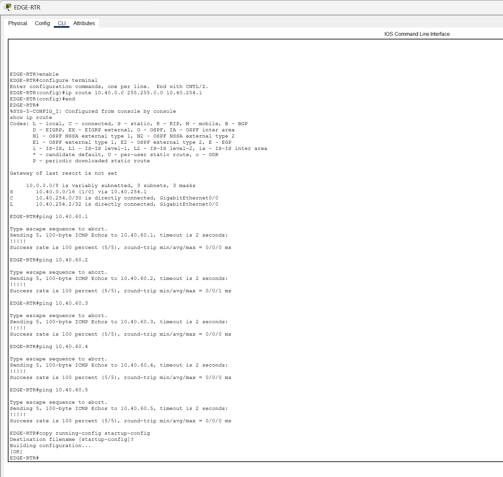

The routed transit remains:

| Device | Interface | Address |
|---|---|---|
| CORE-SW1 | Gi0/1 | `10.40.254.1/30` |
| EDGE-RTR | Gi0/0 | `10.40.254.2/30` |

CORE-SW1 continues to use `0.0.0.0/0 -> 10.40.254.2`, while EDGE-RTR uses `10.40.0.0/16 -> 10.40.254.1` for the return path.

## 3. Server VLAN activation

VLAN 50 had been prepared during Week 5 but remained `up/down` because it had no active Layer 2 members. In Week 6, CORE-SW1 Fa0/1-Fa0/3 were configured as VLAN 50 access ports and used for the internal server segment.

| Server | IPv4 address | Mask | Gateway | Role |
|---|---|---|---|---|
| DHCP-DNS1 | `10.40.50.2` | `/28` | `10.40.50.1` | DHCP and DNS |
| EHR-SRV1 | `10.40.50.3` | `/28` | `10.40.50.1` | EHR web service |
| LOG-SRV1 | `10.40.50.4` | `/28` | `10.40.50.1` | Logging/Syslog target |

After the links came up, Vlan50 changed to `up/up`, `10.40.50.0/28` appeared as a directly connected route, and CORE-SW1 could reach all three server addresses. The first ICMP pass showed normal Packet Tracer ARP learning loss, followed by 100% responses on repeat tests.

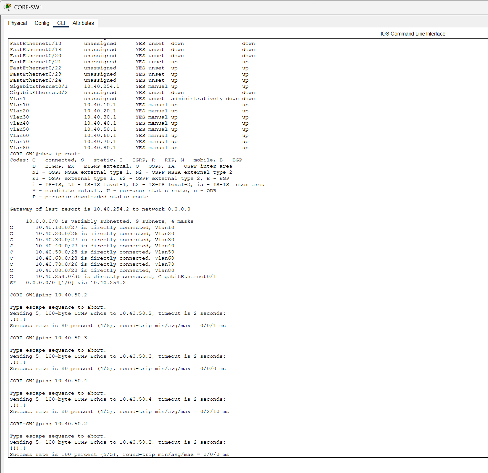

## 4. Centralized DHCP relay on CORE-SW1

Because the DHCP server resides in VLAN 50 while clients live in other VLANs, CORE-SW1 must relay broadcast DHCP requests to `10.40.50.2`. The helper address was added to the routed client SVIs:

```text
interface vlan 10
 ip helper-address 10.40.50.2
interface vlan 20
 ip helper-address 10.40.50.2
interface vlan 30
 ip helper-address 10.40.50.2
interface vlan 40
 ip helper-address 10.40.50.2
interface vlan 70
 ip helper-address 10.40.50.2
interface vlan 80
 ip helper-address 10.40.50.2
```

VLAN 60 does not require the same client DHCP behavior for the switch management addresses because those infrastructure addresses are intentionally static.

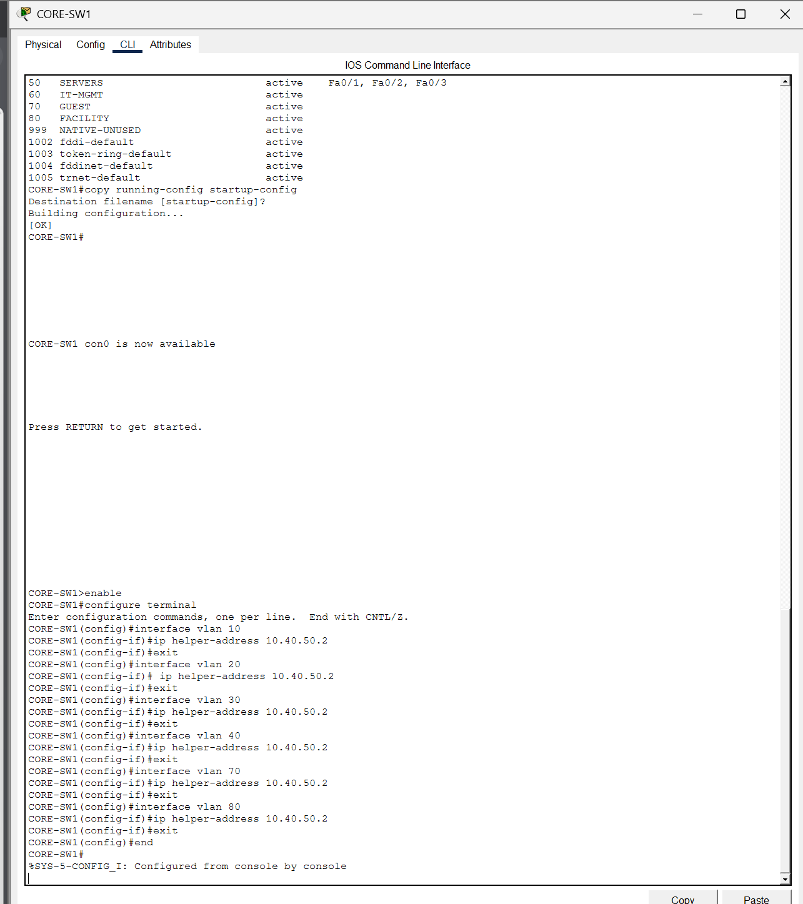

## 5. DHCP service design

DHCP-DNS1 now provides separate scopes that match the AVMC segmentation plan. The `.1` address in each subnet remains the CORE-SW1 SVI gateway, and dynamic allocations begin at `.10` to preserve lower addresses for infrastructure or reserved systems.

| Pool | VLAN | Network/prefix | Gateway | Start address | Max users | DNS |
|---|---:|---|---|---|---:|---|
| ADMIN_POOL | 10 | `10.40.10.0/27` | `10.40.10.1` | `10.40.10.10` | 20 | `10.40.50.2` |
| CLINICAL_POOL | 20 | `10.40.20.0/26` | `10.40.20.1` | `10.40.20.10` | 40 | `10.40.50.2` |
| IMG_LAB_POOL | 30 | `10.40.30.0/27` | `10.40.30.1` | `10.40.30.10` | 20 | `10.40.50.2` |
| MED_IOT_POOL | 40 | `10.40.40.0/27` | `10.40.40.1` | `10.40.40.10` | 20 | `10.40.50.2` |
| GUEST_POOL | 70 | `10.40.70.0/26` | `10.40.70.1` | `10.40.70.10` | 50 | `10.40.50.2` |
| FACILITY_POOL | 80 | `10.40.80.0/28` | `10.40.80.1` | `10.40.80.10` | 5 | `10.40.50.2` |

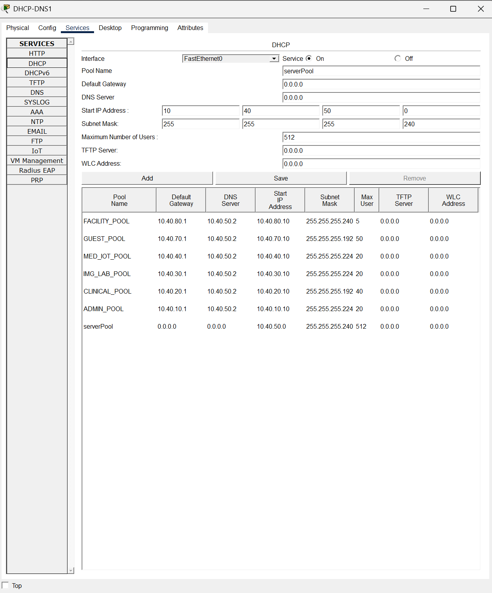

### Packet Tracer note: default `serverPool`

Packet Tracer retained its built-in `serverPool` entry. Attempts to remove it were not productive in the UI, so it was left as a benign simulator artifact while the explicitly named AVMC pools were used for actual client assignments. The important verification was whether each client received an address from the intended subnet with the correct gateway and DNS server.

## 6. DNS service

The internal DNS service was enabled on DHCP-DNS1 and populated with three core A records:

| Name | Address | Purpose |
|---|---|---|
| `dhcp.avmc.local` | `10.40.50.2` | DHCP/DNS server |
| `ehr.avmc.local` | `10.40.50.3` | EHR web server |
| `logs.avmc.local` | `10.40.50.4` | Logging server |

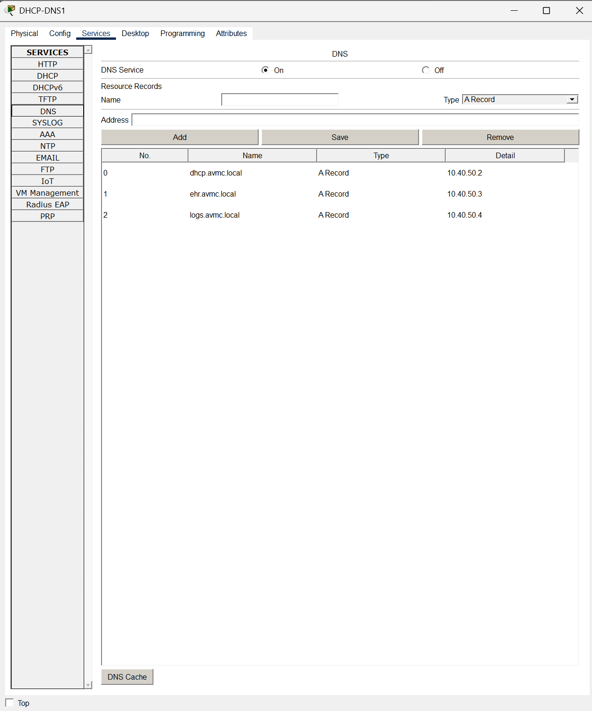

These records allowed endpoint testing to move beyond IP-only pings and confirm that clients were receiving usable DNS information from DHCP.

## 7. EHR application service

EHR-SRV1 was configured statically as `10.40.50.3/28` with gateway `10.40.50.1` and DNS server `10.40.50.2`. HTTP and HTTPS services were enabled in Packet Tracer.

The application test target became:

```text
https://ehr.avmc.local
```

The Packet Tracer page itself is generic, but successful loading proves that the client can resolve the internal DNS name, route to the server VLAN, establish transport/application connectivity, and receive web content.

## 8. ADMIN and IT endpoint validation

REG-PC1 was the first full DHCP client validation. It received:

```text
IPv4 address:    10.40.10.10
Subnet mask:     255.255.255.224
Default gateway: 10.40.10.1
DNS server:      10.40.50.2
```

From REG-PC1, the following all succeeded with 0% packet loss after the lease was obtained:

- `10.40.10.1` - local ADMIN gateway
- `10.40.50.2` - DHCP/DNS server
- `10.40.50.3` - EHR server
- `ehr.avmc.local` - DNS-based EHR test

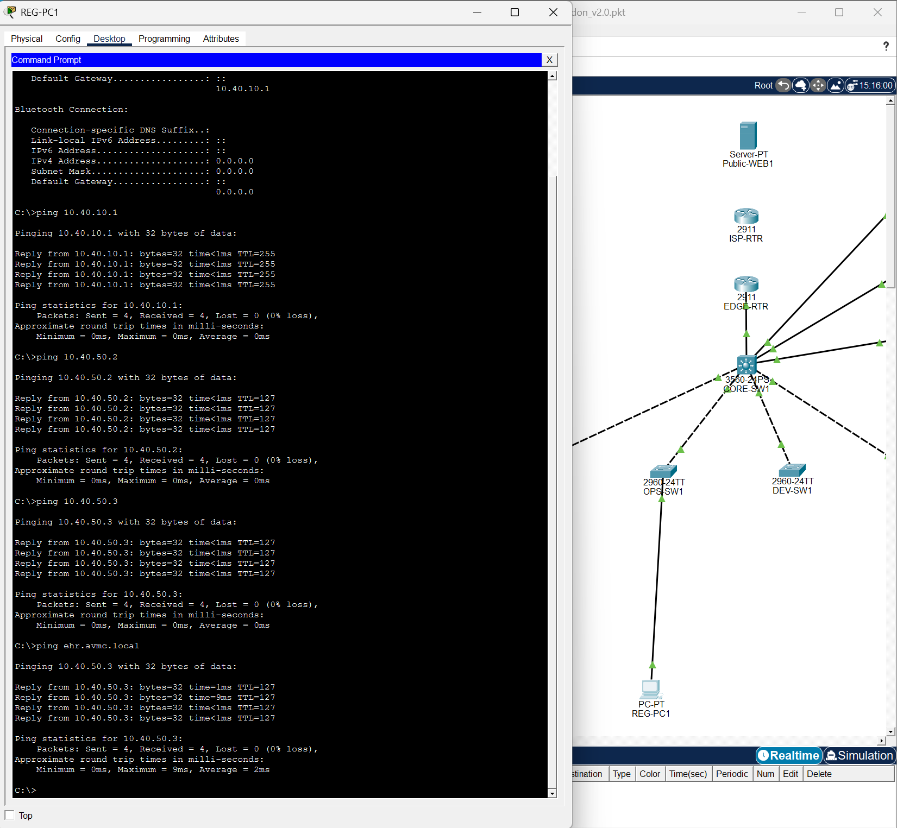

The browser test then successfully opened `https://ehr.avmc.local`.

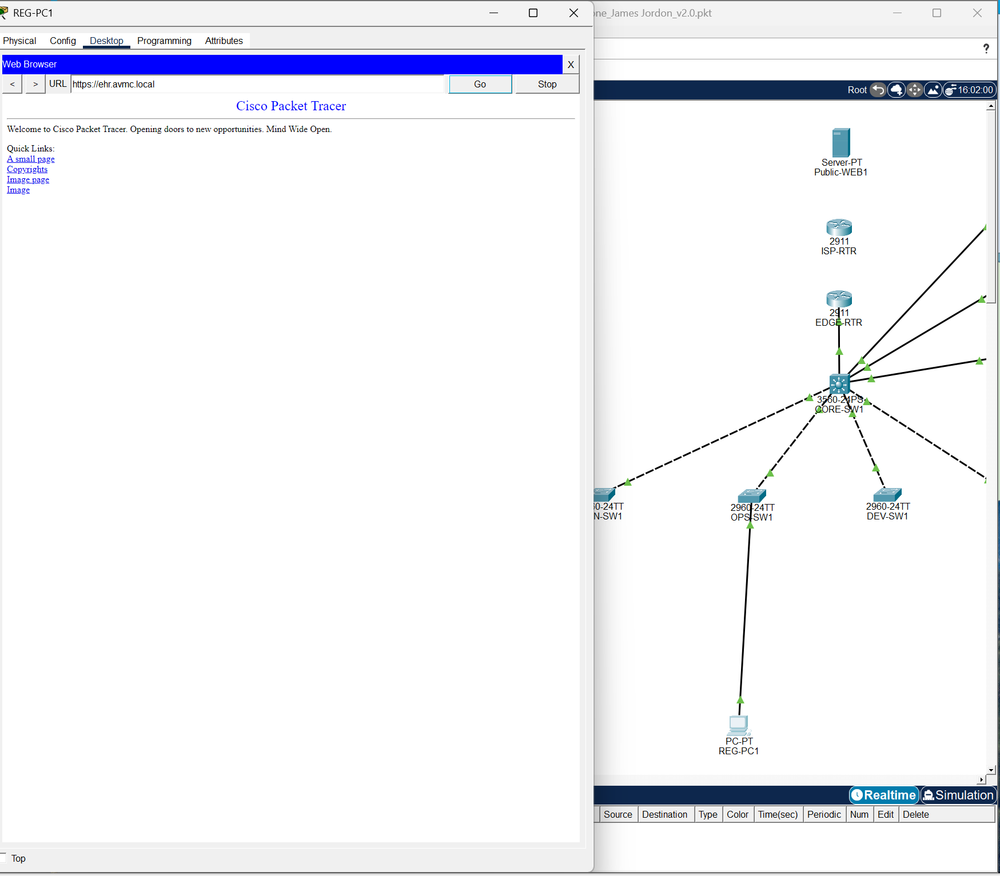

BILLING-PC1 was added to the same OPS-SW1 ADMIN segment and successfully obtained the next DHCP lease (`10.40.10.11`). IT-ADMIN1 remained on VLAN 60 and was validated against the VLAN 60 gateway plus the internal server addresses.

## 9. CLINICAL endpoint validation

CLIN-SW1 was populated with representative clinical workstations, including provider, ER, ICU, pharmacy, nursing, and nurse-administration systems. NURSE-PC1 was used as the full functional test client and received a DHCP address in VLAN 20.

Its validation included successful tests to:

- `10.40.20.1` - CLINICAL gateway
- `10.40.50.2` - DHCP/DNS server
- `10.40.50.3` - EHR server
- `ehr.avmc.local` - DNS name resolution and EHR reachability

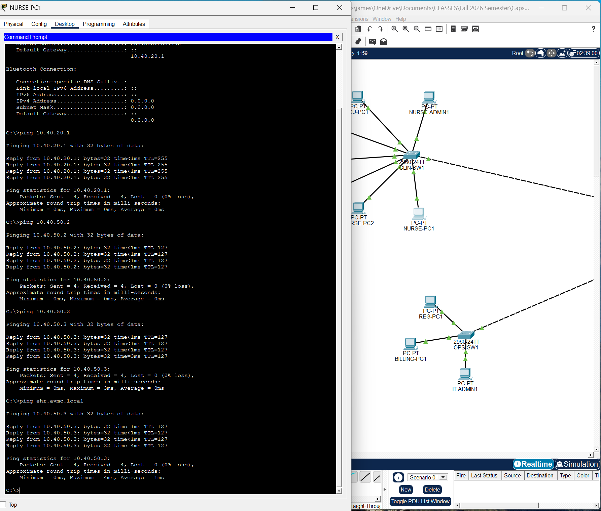

A browser test to `https://ehr.avmc.local` also loaded successfully from the clinical VLAN.

## 10. Imaging/lab endpoint validation

The imaging/lab segment on VLAN 30 was populated with representative systems such as RAD-PC1, LAB-PC1, XRAY-PC1, CT-MRI-PC1, and US-PC1.

RAD-PC1 received `10.40.30.10/27` from DHCP and successfully reached:

- `10.40.30.1` - IMG-LAB gateway
- `10.40.50.2` - DHCP/DNS server
- `10.40.50.3` - EHR server
- `ehr.avmc.local` - DNS/application target

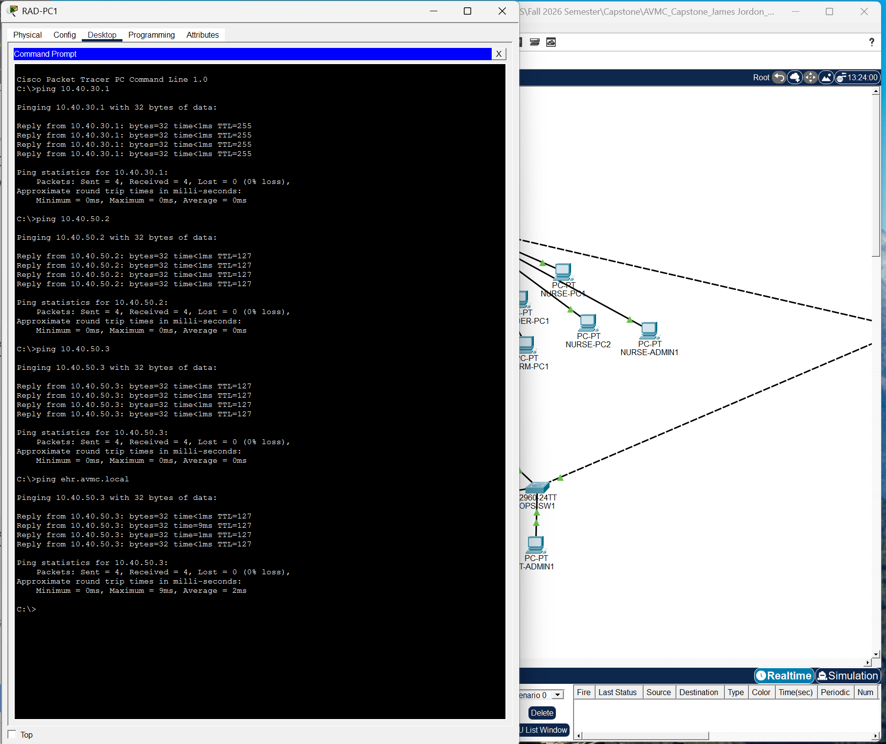

Additional imaging/lab workstations were checked against the VLAN 30 gateway to confirm that their physical links and access-port placement were functioning before deeper per-host testing.

## 11. Medical-IoT wireless build

The next major Week 6 task was to begin the medical-IoT network on DEV-SW1. The access point was connected to DEV-SW1 Fa0/1. That port was changed from a previously unused role into an active MED-IOT access port:

```text
interface FastEthernet0/1
 description AP_MED_IOT
 switchport mode access
 switchport access vlan 40
 spanning-tree portfast
 spanning-tree bpduguard enable
 no shutdown
```

The configuration was saved after the link came up.

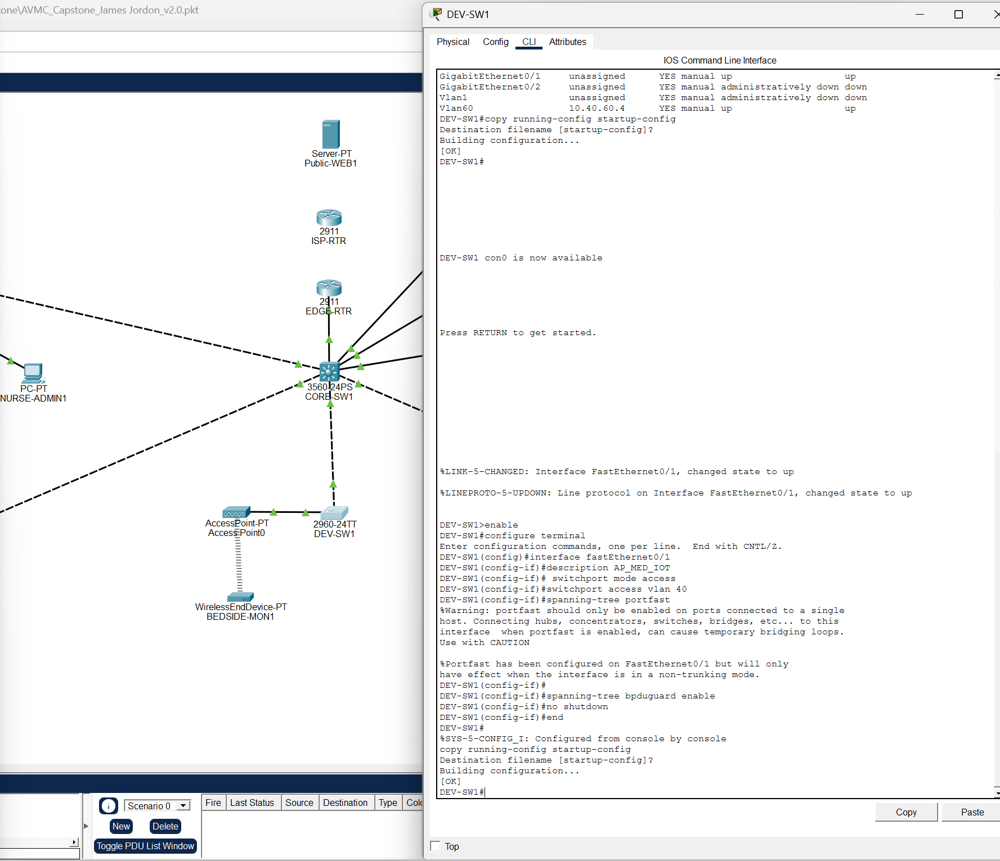

The wireless access point and BEDSIDE-MON1 were associated using WPA2-PSK with AES. The credential itself is intentionally not reproduced in this portfolio report. BEDSIDE-MON1 received `10.40.40.10/27` from the MED-IOT DHCP pool.

### Why 802.1X was not enabled yet

Packet Tracer exposes 802.1X options on some endpoints, but enabling it before configuring the full authentication chain would create a self-inflicted access failure. The Week 6 goal was to prove addressing, VLAN placement, routing, DNS, and application reachability first. 802.1X and related identity controls remain a later hardening phase after the basic network is stable.

## 12. MED-IOT troubleshooting: CLI limitations and a simulator quirk

BEDSIDE-MON1 is a `WirelessEndDevice-PT`, not a PC. It provides Physical, Config, and Attributes tabs but no command prompt. That meant the normal `ipconfig`/`ping` workflow used on PCs was unavailable.

A ping from CORE-SW1 to `10.40.40.10` returned 0%, and the Layer 3 ARP table did not populate an entry for the bedside monitor. DEV-SW1 also did not initially show a conventional endpoint MAC entry on Fa0/1; the access point bridges the wireless client and Packet Tracer abstracts parts of the behavior.

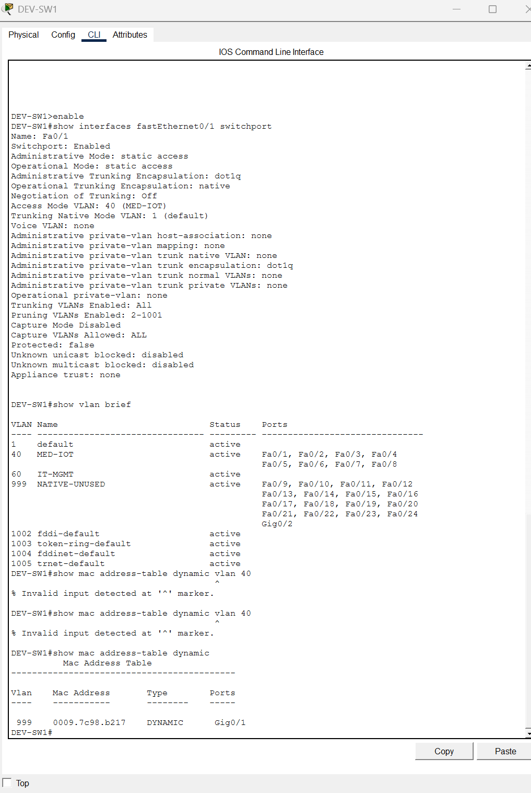

Rather than treating that as proof of a broken VLAN, the test method was changed to Packet Tracer's Simple PDU tool. A Simple PDU from BEDSIDE-MON1 to CORE-SW1 completed successfully, providing simulator-native evidence that the wireless endpoint could traverse the access point and MED-IOT path to the core.

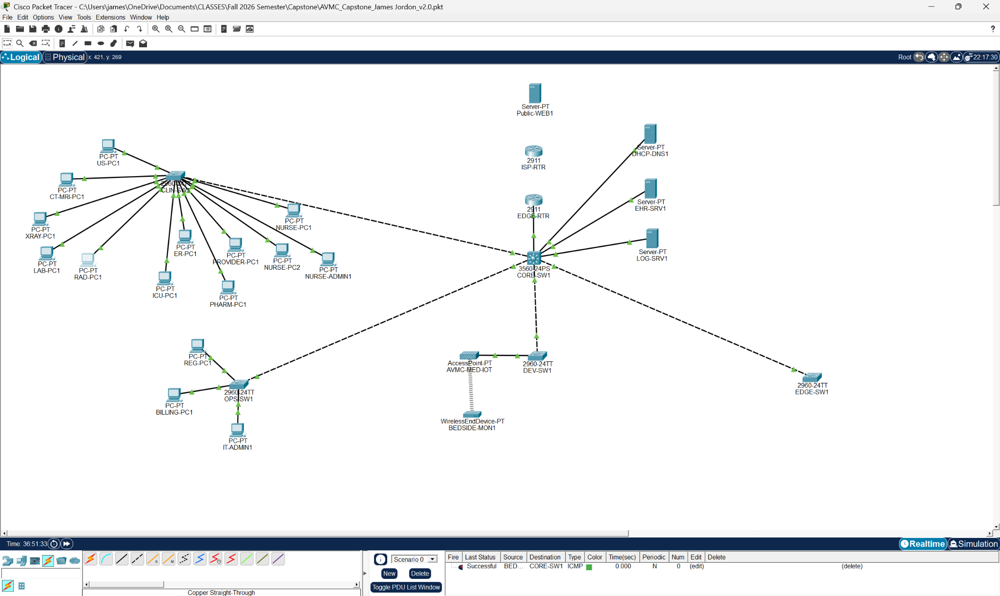

This became the Week 6 stopping point because it proves the first medical-IoT endpoint is integrated without forcing an unreliable PC-style test method onto a different Packet Tracer device class.

## 13. Current addressing and service checkpoint

| VLAN | Name | Gateway | Prefix | Week 6 state |
|---:|---|---|---:|---|
| 10 | ADMIN | `10.40.10.1` | /27 | DHCP and tested clients working |
| 20 | CLINICAL | `10.40.20.1` | /26 | DHCP and tested clients working |
| 30 | IMG-LAB | `10.40.30.1` | /27 | DHCP and representative clients working |
| 40 | MED-IOT | `10.40.40.1` | /27 | DHCP + first wireless IoT endpoint working in Packet Tracer PDU test |
| 50 | SERVERS | `10.40.50.1` | /28 | DHCP/DNS/EHR/LOG servers online |
| 60 | IT-MGMT | `10.40.60.1` | /28 | Static infrastructure management operating |
| 70 | GUEST | `10.40.70.1` | /26 | DHCP pool ready; endpoint validation still pending |
| 80 | FACILITY | `10.40.80.1` | /28 | DHCP pool ready; endpoint validation still pending |
| 999 | NATIVE-UNUSED | none | none | Native/parking VLAN remains in use for hardening |

## 14. Troubleshooting and lessons learned

| Event | Evidence | Resolution/interpretation | Lesson |
|---|---|---|---|
| VLAN 50 initially lacked line protocol | Week 5 Vlan50 `up/down` | Connected server access ports | SVI state depends on live Layer 2 membership |
| First server pings lost one packet | 80% first pass | Repeat after ARP learning gave 100% | Initial Packet Tracer loss can be address-resolution overhead |
| Default DHCP `serverPool` remained | UI would not cleanly remove it | Left it unused; verified named pools by actual leases | Validate behavior, not cosmetic simulator artifacts |
| Wireless end device lacked CLI | No Desktop/Command Prompt tab | Used Config data and Packet Tracer PDU tests | Test method must match device capabilities |
| CORE ping to BEDSIDE-MON1 failed | 0% ICMP; no ARP entry | Used Simple PDU; path succeeded | Packet Tracer device models can abstract ICMP/ARP behavior |
| MED-IOT endpoint security choices | 802.1X available but backend not built | Deferred 802.1X; used WPA2-PSK/AES for current baseline | Do not enable identity enforcement before the authentication path exists |

## 15. Security posture at this checkpoint

The Week 6 build establishes a functional baseline, not the final hardened state. Existing controls already include VLAN segmentation, a dedicated native/unused VLAN, shutdown unused switch ports, PortFast/BPDU Guard on endpoint-facing ports, static infrastructure addressing, WPA2-PSK/AES on the initial medical-IoT wireless path, and centralized services.

The following remain intentionally pending for later phases:

1. Inter-VLAN ACLs that limit access according to job function and device class.
2. Guest isolation from internal hospital networks.
3. Tighter MED-IOT restrictions so device traffic is limited to required services.
4. Facility-network restrictions for cameras, door controllers, HVAC, and badge systems.
5. 802.1X/RADIUS testing where Packet Tracer support is practical.
6. Syslog/NTP and monitoring validation.
7. Internet/ISP path, NAT/PAT, and public-web testing if required by the capstone design.
8. IPv6 planning/hardening after the IPv4 baseline is fully controlled.

## 16. Week 6 stopping point and next session

This is a clean portfolio stopping point because the network has crossed from infrastructure configuration into verified service delivery. The next session should start by expanding the remaining endpoint classes and then move into policy enforcement.

Recommended next sequence:

1. Save the Packet Tracer checkpoint as `AVMC_Capstone_James Jordon_v3.0.pkt`.
2. Add and validate additional MED-IOT endpoints using the same VLAN 40/AP pattern.
3. Bring GUEST VLAN 70 endpoints online and test the DHCP pool.
4. Bring FACILITY VLAN 80 endpoints online and test the DHCP pool.
5. Establish baseline reachability matrices before ACLs are applied.
6. Implement ACLs one policy at a time and document both permitted and denied tests.
7. Add logging/monitoring evidence so denied traffic and infrastructure events can be demonstrated.
8. Revisit 802.1X only after the authentication server/workflow is deliberately configured.

## 17. Week 6 reflection

Week 6 converted the AVMC topology into a functioning multi-VLAN hospital network with centralized services and real end-device behavior. The most important technical milestone was not simply obtaining DHCP leases; it was proving the complete chain from access port to SVI, DHCP relay, server VLAN, DNS resolution, and application access across multiple user segments.

The medical-IoT work also highlighted an important troubleshooting principle: not every Packet Tracer device behaves like a PC. BEDSIDE-MON1 did not provide a CLI and did not respond to the same ICMP/ARP workflow used elsewhere, but the successful Simple PDU demonstrated that the logical path was operating. Changing the verification method rather than repeatedly forcing an unsuitable test produced a defensible stopping point and preserved the project for the next phase.

---

### Evidence set

This report deliberately uses a reduced evidence set. Duplicate and near-duplicate screenshots were removed. The retained twelve images each document a distinct Week 6 milestone, service configuration, endpoint validation, troubleshooting event, or final checkpoint. Screenshots that exposed wireless credentials were intentionally excluded from the portfolio evidence set.
