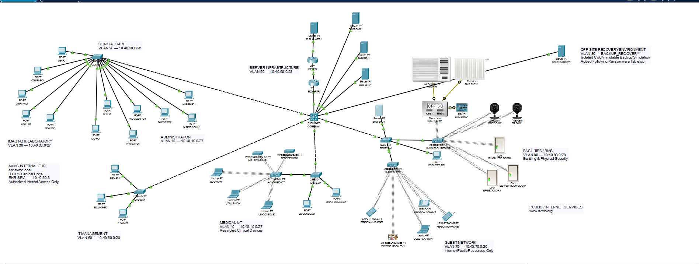

  

# AVMC Security Tool Evidence and Validation Report

**Appalachian Valley Medical Center**  
**Cybersecurity Capstone - Week 8**  
**Security Validation Tool:** Cisco Packet Tracer  
**Test Type:** Ping and Access Control List (ACL) Validation  
**Environment:** Fictional healthcare network simulation

---

## 1. Purpose

The purpose of this validation was to determine whether the security controls implemented in the Appalachian Valley Medical Center (AVMC) network successfully enforce network segmentation and least-privilege access.

Cisco Packet Tracer was used to perform connectivity tests and inspect ACL match counters. Particular attention was given to the new recovery environment created following the AVMC ransomware tabletop exercise.

The tabletop identified a significant weakness in the original design: although AVMC had network services and recovery planning, the architecture did not explicitly include an isolated cold-storage or immutable backup tier. AVMC therefore added VLAN 90, `BACKUP_RECOVERY`, and `COLD-BACKUP1` as a simulation of an isolated recovery environment.

---

## 2. Recovery Environment

| Component | Configuration |
|---|---|
| VLAN | VLAN 90 - `BACKUP_RECOVERY` |
| Network | `10.40.90.0/28` |
| Gateway | `10.40.90.1` |
| Recovery Server | `COLD-BACKUP1` |
| Server Address | `10.40.90.2/28` |
| Purpose | Isolated cold/immutable backup simulation |

Packet Tracer does not simulate a truly offline backup repository, immutable storage platform, or physically disconnected media. VLAN 90 and restrictive ACLs therefore represent the logical isolation that would surround a protected recovery environment in a more complete implementation.

---

## 3. Baseline Test - Before ACL Hardening

After VLAN 90 and `COLD-BACKUP1` were created, connectivity was tested before recovery-specific ACLs were applied. `COLD-BACKUP1` successfully reached the VLAN 90 gateway (`10.40.90.1`), AVMC production DNS/server resource (`10.40.50.2`), Clinical VLAN gateway (`10.40.20.1`), and Facilities/BMS VLAN gateway (`10.40.80.1`).

### Interpretation

The test demonstrated an important distinction between **segmentation and isolation**. Placing the recovery server in a separate VLAN created a distinct Layer 2 network, but `CORE-SW1` was performing Layer 3 routing between AVMC VLANs. Therefore, VLAN separation alone did not prevent the recovery environment from communicating with production networks. Additional access-control enforcement was required.

---

## 4. Recovery-to-Production ACL

AVMC created the extended ACL `COLD-BACKUP-OUT` and applied it inbound to the VLAN 90 SVI. The ACL allowed limited gateway testing while denying routed access from the recovery network to AVMC production networks and other destinations.

AVMC then inspected the ACL using `show access-lists COLD-BACKUP-OUT`.

The deny statement for traffic from VLAN 90 toward AVMC production networks recorded **12 matches**, corresponding to the attempted connectivity tests. The counters demonstrate that the failures resulted from intentional ACL enforcement rather than an unavailable server, incorrect address, broken cable, or routing failure.

---

## 5. Production-to-Recovery ACL

Restricting traffic originating from VLAN 90 addressed only one direction of communication. AVMC also needed to prevent ordinary production systems from initiating connections toward the recovery environment. The extended ACL `COLD-BACKUP-IN` was therefore applied outbound on the VLAN 90 SVI.

A test from `NURSE-PC1` in the Clinical network to `10.40.90.2` resulted in 100 percent packet loss.

`CORE-SW1` was then checked using `show access-lists COLD-BACKUP-IN`.

The four ACL matches correspond directly to the four ICMP attempts generated by `NURSE-PC1`. Together, the two ACLs provide bidirectional isolation between the simulated cold-storage environment and normal AVMC production networks.

---

## 6. Before-and-After Results

| Validation Test | Before Hardening | After Hardening |
|---|---|---|
| `COLD-BACKUP1` to VLAN 90 gateway | Allowed | Allowed |
| `COLD-BACKUP1` to production network | Allowed | Denied |
| `COLD-BACKUP1` to Clinical network | Allowed | Denied |
| `COLD-BACKUP1` to Facilities/BMS | Allowed | Denied |
| Clinical workstation to `COLD-BACKUP1` | Routable before recovery isolation | Denied |
| ACL counters verify enforcement | N/A | Confirmed |

The tests demonstrate that the network moved from simple VLAN separation to policy-enforced recovery isolation.

---

## 7. Relationship to the Ransomware Tabletop

This validation was performed as a direct result of the AVMC ransomware tabletop exercise. During the tabletop, compromise of the online backup environment exposed a recovery weakness in the original architecture. AVMC identified the absence of an isolated recovery tier as a corrective action.

The network design was subsequently modified to include VLAN 90 - `BACKUP_RECOVERY`, `COLD-BACKUP1`, dedicated recovery addressing, and bidirectional ACL enforcement.

This provides a complete security-improvement cycle: **Identify weakness -> Design remediation -> Implement control -> Test control -> Verify enforcement.**

---

## 8. Additional AVMC Segmentation Validation

The VLAN 90 test was not the only security validation performed during the AVMC project. Additional Packet Tracer testing validated security boundaries involving Guest VLAN 70, Medical IoT VLAN 40, and Facilities/BMS VLAN 80. Guest systems retained required network and public-resource access while protected internal resources were denied. Medical IoT retained required DNS and EHR HTTPS access while unrelated internal and public access was restricted. Facilities/BMS retained required building-management functions while clinical/server and public-network access was restricted.

These tests demonstrate a common design principle: **AVMC systems should receive the minimum network connectivity required for their intended function rather than unrestricted access based only on VLAN membership.**

---

## 9. Limitations

Cisco Packet Tracer provides a useful environment for demonstrating VLANs, routing, ACLs, addressing, and selected security behavior, but it does not reproduce all controls required in a production healthcare environment. `COLD-BACKUP1` represents the concept of an isolated cold or immutable recovery tier, not a true immutable storage platform or physically offline backup device.

A production implementation would require additional controls such as offline or immutable storage, separate backup-administration credentials, encryption, integrity validation, controlled restoration, multi-factor authentication, centralized monitoring, endpoint detection and response, vulnerability and patch management, application-aware firewalls, physical security, periodic recovery testing, and vendor-supported controls for medical and building-management devices.

---

## 10. Conclusion

The Packet Tracer tests demonstrated that the AVMC network can enforce intentional security boundaries through ACL-controlled segmentation. Initial testing showed that VLAN separation alone still permitted routed communication between `COLD-BACKUP1` and production networks. AVMC then implemented bidirectional ACL restrictions and repeated the tests.

Following hardening, `COLD-BACKUP1` retained access to its local recovery gateway while recovery-to-production and production-to-recovery communication were denied. ACL match counters independently confirmed that `CORE-SW1` was intentionally denying the tested traffic. Additional Guest, Medical IoT, and Facilities/BMS testing demonstrated that authorized functions could be preserved while unnecessary access between trust zones was restricted.

The validation process followed a repeatable security-engineering cycle: **Establish baseline -> Identify weakness -> Design control -> Implement control -> Test behavior -> Verify enforcement -> Document results.**

---

*Appalachian Valley Medical Center | Information Technology & Security*  
*Cybersecurity Capstone - Week 8*  
*Fictional healthcare environment created for educational purposes.*
