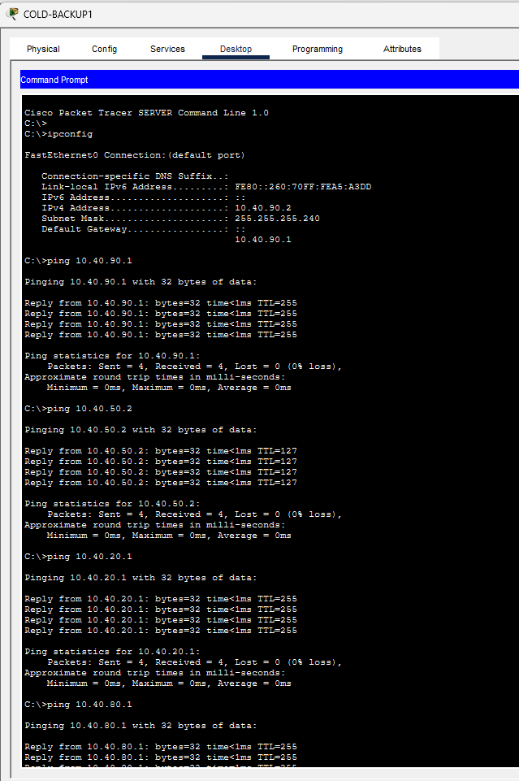
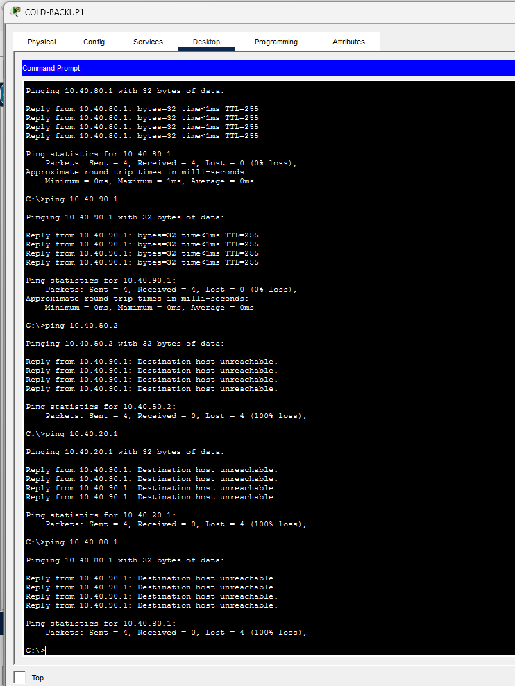
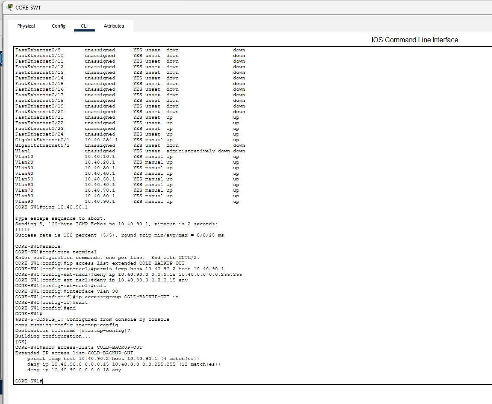
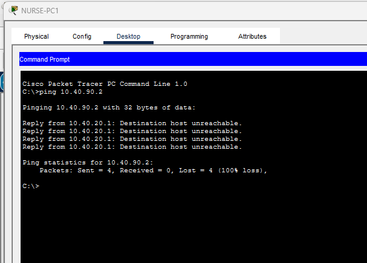
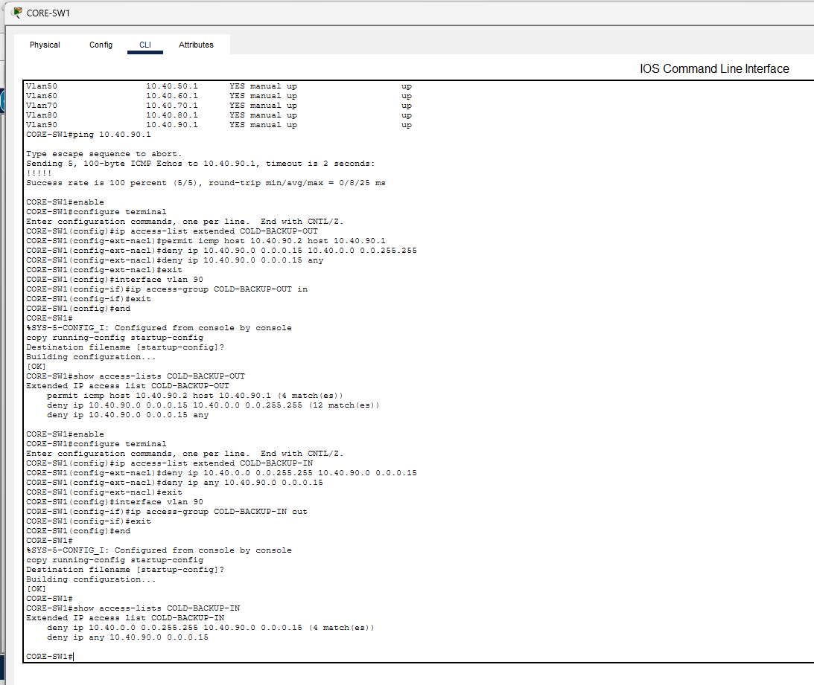
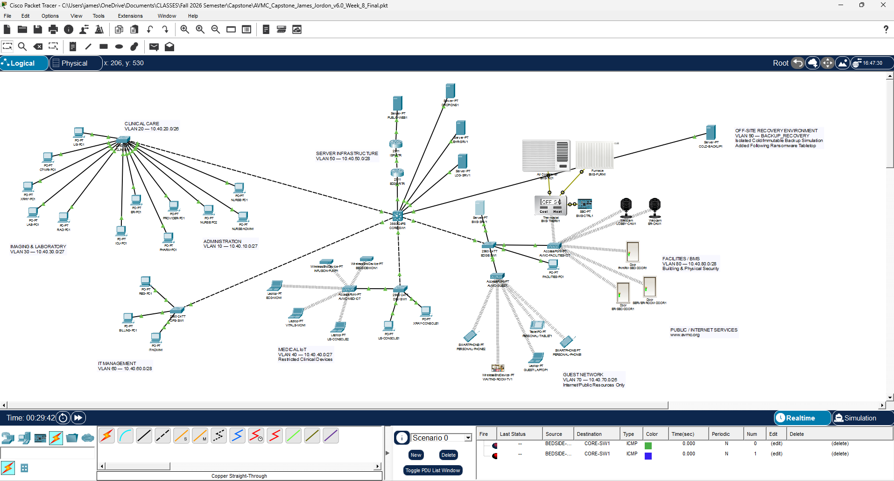

  

# AVMC Security Tool Evidence and Validation Report

**Appalachian Valley Medical Center**  
**Cybersecurity Capstone – Week 8**  
**Security Validation Tool:** Cisco Packet Tracer  
**Test Type:** Ping and Access Control List (ACL) Validation  
**Environment:** Fictional healthcare network simulation

---

## 1. Purpose

The purpose of this validation was to determine whether the security controls implemented in the Appalachian Valley Medical Center (AVMC) network successfully enforce network segmentation and least-privilege access.

Cisco Packet Tracer was used to perform connectivity tests and inspect ACL match counters. Particular attention was given to the new recovery environment created following the AVMC ransomware tabletop exercise.

The tabletop identified a significant weakness in the original design: although AVMC had network services and recovery planning, the architecture did not explicitly include an isolated cold-storage or immutable backup tier. AVMC therefore added VLAN 90, `BACKUP_RECOVERY`, and `COLD-BACKUP1` as a simulation of an isolated recovery environment.

---

## 2. Recovery Environment

The recovery environment was configured as:

| Component | Configuration |
|---|---|
| VLAN | VLAN 90 – `BACKUP_RECOVERY` |
| Network | `10.40.90.0/28` |
| Gateway | `10.40.90.1` |
| Recovery Server | `COLD-BACKUP1` |
| Server Address | `10.40.90.2/28` |
| Purpose | Isolated cold/immutable backup simulation |

Packet Tracer does not simulate a truly offline backup repository, immutable storage platform, or physically disconnected media. VLAN 90 and restrictive ACLs therefore represent the logical isolation that would surround a protected recovery environment in a more complete implementation.

---

## 3. Baseline Test – Before ACL Hardening

After VLAN 90 and `COLD-BACKUP1` were created, connectivity was tested before recovery-specific ACLs were applied.

`COLD-BACKUP1` successfully reached:

- `10.40.90.1` – VLAN 90 gateway
- `10.40.50.2` – AVMC production DNS/server resource
- `10.40.20.1` – Clinical VLAN gateway
- `10.40.80.1` – Facilities/BMS VLAN gateway

### Interpretation

The test demonstrated an important distinction between **segmentation and isolation**.

Placing the recovery server in a separate VLAN created a distinct Layer 2 network, but `CORE-SW1` was performing Layer 3 routing between AVMC VLANs. Therefore, VLAN separation alone did not prevent the recovery environment from communicating with production networks.

If ransomware or another attacker compromised a system with unrestricted routed access to the recovery environment, the protected backup tier could potentially become another reachable target.

Additional access-control enforcement was therefore required.

---

## 4. Recovery-to-Production ACL

AVMC created the extended ACL `COLD-BACKUP-OUT` and applied it inbound to the VLAN 90 SVI.

The ACL allowed limited gateway testing while denying routed access from the recovery network to AVMC production networks and other destinations.

After the ACL was applied, `COLD-BACKUP1` was tested again.

The recovery gateway remained reachable, while attempts to reach production resources were denied.

### ACL Counter Validation

AVMC then inspected the ACL using:

    show access-lists COLD-BACKUP-OUT

The ACL displayed match counters on its deny rule.

The deny statement for traffic from VLAN 90 toward AVMC production networks recorded **12 matches**, corresponding to the attempted connectivity tests.

### Interpretation

The match counters demonstrate that the failed connectivity tests were not caused by an unavailable server, incorrect address, broken cable, or routing failure.

`CORE-SW1` received the traffic and intentionally denied it according to the configured security policy.

---

## 5. Production-to-Recovery ACL

Restricting traffic originating from VLAN 90 addressed only one direction of communication.

AVMC also needed to prevent ordinary production systems from initiating connections toward the recovery environment.

The extended ACL `COLD-BACKUP-IN` was therefore applied outbound on the VLAN 90 SVI.

A test was performed from `NURSE-PC1`, located in the Clinical network, toward:

    10.40.90.2

The result was:

    Reply from 10.40.20.1: Destination host unreachable.
    Packets: Sent = 4, Received = 0, Lost = 4 (100% loss)

### ACL Counter Validation

`CORE-SW1` was then checked using:

    show access-lists COLD-BACKUP-IN

The ACL recorded:

    deny ip 10.40.0.0 0.0.255.255 10.40.90.0 0.0.0.15
        (4 match(es))

The four ACL matches correspond directly to the four ICMP attempts generated by `NURSE-PC1`.

### Interpretation

This test confirms that AVMC production systems cannot initiate ordinary routed communication with the recovery network.

Together, the two ACLs provide bidirectional isolation between the simulated cold-storage environment and normal AVMC production networks.

---

## 6. Before-and-After Results

| Validation Test | Before Hardening | After Hardening |
|---|---|---|
| `COLD-BACKUP1` → VLAN 90 gateway | Allowed | Allowed |
| `COLD-BACKUP1` → production network | Allowed | Denied |
| `COLD-BACKUP1` → Clinical network | Allowed | Denied |
| `COLD-BACKUP1` → Facilities/BMS | Allowed | Denied |
| Clinical workstation → `COLD-BACKUP1` | Routable before recovery isolation | Denied |
| ACL counters verify enforcement | N/A | Confirmed |

The tests demonstrate that the network moved from simple VLAN separation to policy-enforced recovery isolation.

---

## 7. Relationship to the Ransomware Tabletop

This validation was performed as a direct result of the AVMC ransomware tabletop exercise.

During the tabletop, compromise of the online backup environment exposed a recovery weakness in the original architecture. AVMC identified the absence of an isolated recovery tier as a corrective action.

The network design was subsequently modified to include:

- VLAN 90 – `BACKUP_RECOVERY`
- `COLD-BACKUP1`
- dedicated recovery addressing
- recovery-to-production ACL enforcement
- production-to-recovery ACL enforcement

The completed architecture reflects that change.

This provides a complete security-improvement cycle:

**Identify weakness → Design remediation → Implement control → Test control → Verify enforcement**

The recovery environment therefore represents more than an additional network segment. It is a documented architecture change resulting directly from the findings of the incident-response tabletop.

---

## 8. Additional AVMC Segmentation Validation

The VLAN 90 test was not the only security validation performed during the AVMC project.

Additional Packet Tracer testing was used to validate security boundaries involving the Guest, Medical IoT, and Facilities/BMS networks.

### Guest VLAN 70

Guest devices were tested before and after application of the `GUEST-IN` ACL.

The final policy allows required guest services and approved public access while preventing guest systems from accessing protected AVMC internal networks.

Testing demonstrated that:

- the Guest VLAN gateway remained reachable;
- DNS remained available;
- the public AVMC website remained accessible;
- the internal EHR server became inaccessible;
- attempts to reach protected AVMC resources generated ACL deny matches.

This demonstrated that guest users could retain the services required for a waiting-room network without receiving access to protected hospital systems.

### Medical IoT VLAN 40

Medical IoT testing demonstrated service-level least privilege.

The final `MED-IOT-IN` policy allowed Medical IoT devices to:

- reach their VLAN gateway;
- use required DNS services;
- access the EHR service over HTTPS.

The policy denied:

- unrelated internal AVMC access;
- unnecessary ICMP access to the EHR server;
- general Internet/public-network access.

The successful EHR webpage load combined with a failed ICMP test to the same server demonstrated that the ACL was filtering by required service rather than simply allowing unrestricted access to the destination.

ACL counters confirmed both permitted HTTPS traffic and denied unauthorized traffic.

### Facilities/BMS VLAN 80

Facilities/BMS testing demonstrated that operational building-management functions could remain available while clinical and public-network access was restricted.

Following application of `FACILITY-IN`:

- the VLAN 80 gateway remained reachable;
- `BMS-SRV1` remained available;
- registered HVAC, door-control, and camera devices remained functional;
- EHR access was denied;
- public AVMC web access was denied;
- ACL counters confirmed enforcement.

This demonstrated that security hardening did not require AVMC to destroy the operational function of the Facilities/BMS environment.

### Overall Segmentation Finding

The Guest, Medical IoT, Facilities/BMS, and Backup/Recovery tests all demonstrated the same design principle:

> **AVMC systems should receive the minimum network connectivity required for their intended function rather than unrestricted access based only on VLAN membership.**

---

## 9. Limitations

Cisco Packet Tracer provides a useful environment for demonstrating VLANs, routing, ACLs, addressing, and selected security behavior, but the simulation does not reproduce all controls required in a production healthcare environment.

In particular, `COLD-BACKUP1` represents the concept of an isolated cold or immutable recovery tier. A production implementation would require additional technologies and procedures for:

- physically offline or immutable storage;
- separate backup-administration credentials;
- encryption of backup data;
- backup integrity validation;
- controlled backup and restoration processes;
- multi-factor authentication;
- centralized security monitoring;
- endpoint detection and response;
- vulnerability and patch management;
- application-aware firewall controls;
- physical security;
- periodic recovery testing;
- vendor-supported controls for medical and building-management devices.

The Packet Tracer evidence should therefore be interpreted as validation of the **network segmentation and ACL design**, not as a complete implementation of enterprise healthcare security or ransomware-resistant backup infrastructure.

The simulation also cannot fully reproduce the operational constraints of a real hospital. In a production environment, containment decisions affecting clinical systems, Medical IoT, life-safety systems, or Facilities/BMS infrastructure would require formal change control and coordination with clinical, biomedical, facilities, security, and vendor personnel.

These limitations were documented rather than treated as capabilities that Packet Tracer does not actually provide.

---

## 10. Conclusion

The Packet Tracer tests demonstrated that the AVMC network can enforce intentional security boundaries through ACL-controlled segmentation.

The most significant validation involved the recovery environment created after the ransomware tabletop. Initial testing demonstrated that VLAN separation alone still permitted routed communication between `COLD-BACKUP1` and production networks.

AVMC then implemented bidirectional ACL restrictions and repeated the tests.

Following hardening:

- `COLD-BACKUP1` retained access to its local recovery gateway;
- recovery-to-production communication was denied;
- production-to-recovery communication was denied;
- Clinical access attempts toward `COLD-BACKUP1` failed;
- ACL match counters independently confirmed that `CORE-SW1` was intentionally denying the tested traffic.

Additional testing of Guest VLAN 70, Medical IoT VLAN 40, and Facilities/BMS VLAN 80 demonstrated that AVMC could preserve authorized business and clinical functions while restricting unnecessary access between trust zones.

The results therefore show that the implemented security controls behaved as intended and that the ransomware tabletop produced a measurable improvement to the AVMC architecture.

Most importantly, the testing demonstrated that **VLAN creation alone does not equal security**. Effective segmentation required explicit access-control policy, technical enforcement, testing of both permitted and denied traffic, and verification through ACL counters.

The AVMC validation process followed a repeatable security-engineering cycle:

**Establish baseline → Identify weakness → Design control → Implement control → Test behavior → Verify enforcement → Document results**

This process transformed the final AVMC network from a functioning segmented topology into a tested, policy-enforced cybersecurity architecture suitable for demonstrating the security concepts required by the capstone.

---

*Appalachian Valley Medical Center | Information Technology & Security*  
*Cybersecurity Capstone – Week 8*  
*Fictional healthcare environment created for educational purposes.*
